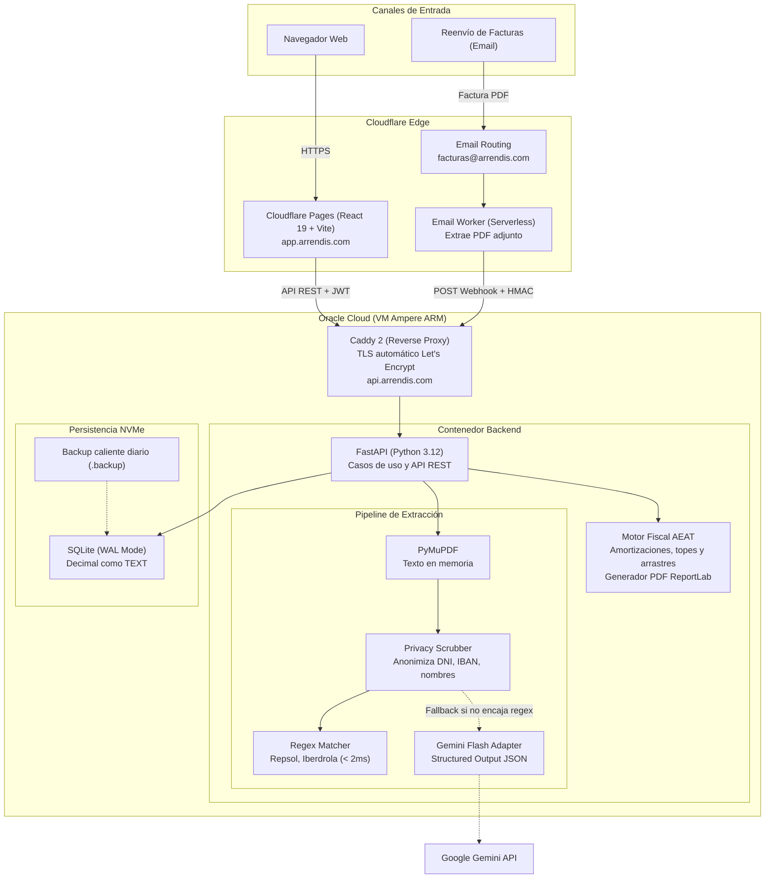

# Arrendis — Plataforma Integral de Gestión Patrimonial y Motor Fiscal AEAT

[](.github/workflows/deploy.yml)
[](tests/)
[](requirements.txt)
[](backend/)
[](frontend/)
[](#arquitectura-hexagonal-y-ddd)
[](https://oracle.com)

> **Arrendis** es una plataforma SaaS desarrollada para propietarios e inversores inmobiliarios particulares en España. Resuelve la gestión de inmuebles y contratos, la ingesta automática de facturas de suministros y la liquidación del **IRPF inmobiliario (Modelo 100 AEAT)** con generación de borradores oficiales.

---

## Resumen técnico

* **Arquitectura Hexagonal y DDD estricto**: Dominio en Python puro sin dependencias de frameworks externos, con puertos tipados y adaptadores intercambiables.
* **Spec-Driven Development (SDD)**: Metodología donde el desarrollador actúa como arquitecto orquestador y la IA como motor de ejecución guiado por especificaciones formales (`specs/`), puertas de aprobación de diseño antes de escribir código y distribución de la implementación del spec entre subagentes implementadores y revisores.
* **Autenticación Shielded JWT**: Sistema híbrido de doble token (Access Token en memoria de React y Refresh Token en cookie HttpOnly) para mitigar vectores XSS y CSRF, con aislamiento multi-tenant estricto.
* **Procesamiento Inteligente de Facturas (Edge + LLM)**: Ingesta serverless por correo (`facturas@arrendis.com`), anonimización de datos personales con `PrivacyScrubber` (RGPD) y extracción híbrida: Regex de alta velocidad (<2 ms) con fallback a Google Gemini Flash.
* **Motor Fiscal AEAT**: Modelado algorítmico de la normativa tributaria española utilizando todas las casillas oficiales de hacienda con generación de informe en PDF.
* **Infraestructura Cloud Real**: Despliegue distribuido en Cloudflare Pages (Frontend SPA), Cloudflare Workers (Ingesta email), Caddy 2 (Reverse proxy con TLS automático) y Oracle Cloud Infrastructure Ampere VM (Backend en Docker) con SQLite en modo WAL y hot-backups automatizados.
* **Testing y CICD**: Suite de más de **350 pruebas automatizadas** (unitarias, de integración y ciclo de vida E2E) integradas en un pipeline de CI/CD en GitHub Actions con despliegue continuo por SSH.

---

## Arquitectura del sistema



---

## Autenticación: Sistema de doble token (Shielded JWT)

Para proteger la aplicación sin degradar la experiencia de usuario ni depender de servicios externos de pago, implementé un esquema híbrido de doble token que previene tanto ataques XSS como CSRF:

* **Access Token (corta duración, 60 min)**:
  * Se entrega en el cuerpo de la respuesta JSON tras el login.
  * Se guarda **únicamente en la memoria de React** (nunca en `localStorage` ni `sessionStorage`). Si alguien consigue inyectar un script malicioso (XSS), no puede extraer tokens persistentes del almacenamiento local.
  * Se envía en la cabecera estándar `Authorization: Bearer <token>` en cada llamada a la API, lo que protege contra peticiones cruzadas (CSRF).
* **Refresh Token (larga duración, 7 días)**:
  * Se envía al navegador dentro de una cookie marcada como `HttpOnly`, `Secure` y `SameSite=Lax`.
  * El motor de JavaScript del navegador tiene vetado el acceso a esta cookie, impidiendo su lectura por cualquier script del frontend.
  * Se utiliza de forma transparente mediante el endpoint `/api/auth/refresh` para regenerar el Access Token cuando caduca o cuando el usuario recarga la página.
* **Aislamiento Multi-Tenancy**:
  * El dominio define los puertos `PasswordHasherPort` (implementado con `bcrypt`) y `TokenServicePort` (con `PyJWT`).
  * En cada petición protegida, FastAPI extrae el `user_id` criptográficamente verificado del token e inyecta el contexto en los casos de uso. Ningún repositorio permite consultar o modificar propiedades, gastos o ingresos sin filtrar explícitamente por el `user_id` del usuario autenticado.

---

## Arquitectura: Hexagonal y DDD

El backend utiliza Arquitectura Hexagonal y Domain-Driven Design para mantener la lógica de negocio aislada de librerías, bases de datos y frameworks web:

```
backend/
├── domain/                  # Lógica pura en Python (0 dependencias externas)
│   ├── entities.py          # Property, Expense, Income, LeaseContract, User
│   ├── value_objects.py     # Money, CadastralBreakdown, AcquisitionCost, FiscalReport
│   ├── services.py          # FiscalCalculator, ProfitCalculator, FiscalCategoryMapper
│   ├── extraction.py        # PrivacyScrubber, UtilityRegistry, RepsolStrategy
│   └── ports.py             # Interfaces abstractas (Repositorios, LLM, PDF)
├── application/             # Casos de uso (orquestación)
│   └── use_cases.py         # ProcessUtilityInvoice, CalculateFiscalReport...
├── adapters/                # Implementaciones técnicas concretas
│   ├── sqlite_adapter.py    # Persistencia SQLite con modo WAL y transacciones
│   ├── gemini_adapter.py    # Cliente Gemini con retry exponencial y JSON schema
│   ├── pdf_extractor_adapter.py # Extracción de texto con PyMuPDF
│   ├── aeat_pdf_renderer_adapter.py # Renderizado del borrador en PDF con ReportLab
│   └── auth_adapter.py      # Bcrypt y JWT
└── api/                     # Capa web FastAPI
    ├── routes/              # Endpoints HTTP
    ├── schemas.py           # Validación de DTOs con Pydantic v2
    └── dependencies.py      # Inyección de dependencias
```

* **Dominio sin frameworks**: No hay imports de FastAPI, SQLAlchemy ni librerías de terceros en `domain/`. Todo son clases de Python, dataclasses inmutables y puertos (`ABC`).
* **Precisión monetaria**: El dinero y los porcentajes fiscales se calculan con el tipo `Decimal` y se guardan como `TEXT` en SQLite para evitar los errores de redondeo que provocan los tipos `float`.
* **Value Objects inmutables**: Conceptos como `Money` o `CadastralBreakdown` son inmutables (`frozen=True`) y se validan en el momento de creación, garantizando que el sistema nunca maneje estados inconsistentes.

---

## Cómo he usado la IA: Spec-Driven Development (SDD)

El código no se ha generado con prompts improvisados ni copiando fragmentos de un chat. He seguido la metodología **Spec-Driven Development (SDD)** apoyándome en **Antigravity CLI (`agy`)**:

1. **Yo defino la arquitectura**: En `agents.md` dejo establecidas las reglas estrictas del proyecto (cero frameworks en el dominio, uso de puertos y adaptadores, convenciones de nombres y TDD obligatorio).
2. **Especificación antes de programar**: Antes de implementar cualquier funcionalidad, se redacta el diseño técnico en la carpeta `specs/` (diagramas de flujo, invariantes y casos borde).
3. **Punto de control y aprobación**: La IA propone un plan de implementación estructurado en un artefacto. Como desarrollador, reviso el diseño propuesto, corrijo decisiones arquitectónicas si hace falta y apruebo formalmente el plan.
4. **Implementación con subagentes en paralelo**: Con el plan validado, se lanzan subagentes especializados (backend, frontend, testing) que escriben el código respetando los contratos de los puertos definidos.

---

## Extracción de facturas y privacidad (RGPD)

Procesar facturas de luz y gas suele ser tedioso para el usuario. El sistema automatiza este flujo resolviendo dos problemas técnicos: el coste de los modelos de lenguaje y la privacidad de los datos personales.

1. **Ingesta automática por email**:
   * El usuario reenvía sus facturas a `facturas@arrendis.com`.
   * Un **Cloudflare Worker** serverless intercepta el correo entrante, extrae el archivo PDF adjunto y hace un POST al webhook de la API validando una clave secreta.
2. **Anonimizador previo (Privacy Scrubber)**:
   * Antes de pasar el texto de la factura a cualquier API externa, un servicio de dominio elimina datos personales mediante expresiones regulares:
     `DNI/NIE/CIF -> [REDACTED_NIF]`, `IBAN -> [REDACTED_IBAN]`, nombres y direcciones postales.
   * Se conservan intactos los datos necesarios para la gestión contable: el código **CUPS** (con el que se asocia la factura a la vivienda automáticamente), fechas e importes.
3. **Estrategia de extracción híbrida**:
   * **Paso 1 (Regex determinista)**: Para comercializadoras conocidas (Repsol, etc.), un parser propio extrae los campos en **menos de 2 ms** con **coste 0**.
   * **Paso 2 (Fallback con Gemini Flash)**: Si la factura es de una compañía no reconocida o el layout cambia, se envía el texto ya anonimizado a Gemini Flash pidiendo salida JSON estructurada y aplicando reintentos exponenciales con `tenacity`.

---

## Motor de cálculo fiscal (Modelo 100 AEAT)

El motor `FiscalCalculator` traduce a código las reglas de la Agencia Tributaria para el cálculo del IRPF en alquileres de vivienda:

* **Amortización de inmuebles (Art. 23.1.b LIRPF)**: Aplica el 3% anual sobre el mayor entre el coste de compra (restando la parte del suelo según el porcentaje del catastro) y el valor catastral de la construcción, sumando proporcionalmente los gastos de adquisición (notaría, ITP, registro).
* **Amortización de muebles**: Aplica el 10% anual para enseres comprados en los últimos 10 años.
* **Tope de gastos de reparación y financiación**: Los intereses de hipoteca y los gastos de conservación no pueden generar rendimientos negativos por sí mismos. El motor calcula el límite y **gestiona el arrastre de saldos pendientes (carryforward) para compensarlos durante los 4 años siguientes**.
* **Prorrateo por días arrendados**: Pondera los gastos deducibles según los días que el inmueble ha estado alquilado en el año, gestionando años bisiestos (366 días) y contratos solapados.
* **Reducciones de vivienda habitual**: Aplica la reducción general del 60% o los porcentajes adaptados a la Ley de Vivienda.
* **Generación de borrador oficial**: Con `ReportLab` se genera un PDF con la estructura de casillas del Modelo 100 listo para contrastar con el borrador de Hacienda.

---

## Estrategia de Testing

El proyecto cuenta con más de **350 tests automatizados** con `pytest`:

* **Unitarios de dominio**: Pruebas de valor fiscal (23 casos borde de amortizaciones, topes y arrastres), inmutabilidad de Value Objects, anonimización con `PrivacyScrubber` y parsers regex.
* **Integración**: Repositorios SQLite comprobando transacciones y modo WAL, extracción sobre PDFs reales y endpoints de FastAPI con autenticación.
* **Ciclo de vida E2E**: Pruebas que simulan años fiscales completos y la compensación de excesos a lo largo de 4 ejercicios consecutivos.
* **Tests sin coste ni red**: Las llamadas al LLM están mockeadas a nivel de puerto en la suite de CI. Toda la batería de pruebas corre en local o en GitHub Actions en unos 2 segundos.

```bash
========================= 350 passed in 2.14s =========================
```

---

## Infraestructura en producción (0 €/mes)

El proyecto está desplegado en internet utilizando capas gratuitas de proveedores cloud consolidados:

| Capa | Servicio | Función |
| :--- | :--- | :--- |
| **Frontend** | Cloudflare Pages | Despliegue estático de la SPA en React 19 con CDN global. |
| **Email Worker** | Cloudflare Workers | Ingesta serverless del correo en el edge sin mantener servidores de correo. |
| **Reverse Proxy** | Caddy 2 (Docker) | Gestión y renovación automática de certificados SSL/TLS con Let's Encrypt y HTTP/2. |
| **Backend** | Oracle Cloud (Always Free) | Máquina virtual Ampere ARM (Ubuntu 24.04) corriendo el contenedor Docker. |
| **Persistencia** | SQLite 3 en NVMe | Configurado en modo WAL (`PRAGMA journal_mode=WAL`) para soportar lecturas concurrentes sin bloqueos. |
| **Backups** | Cron script | Copia de seguridad diaria a las 03:00 AM mediante el comando `.backup` de SQLite (sin parar el servidor) con rotación a 30 días. |

### CI/CD con GitHub Actions

El pipeline en [`.github/workflows/deploy.yml`](.github/workflows/deploy.yml) automatiza las fases de verificación y despliegue ante cada push a `main`:

1. **CI**: Ejecuta los 350 tests del backend con `pytest` en Python 3.12 y valida el chequeo de tipos (`tsc`) y build de Vite en Node 22.
2. **CD**: Si los tests pasan, se conecta por SSH a la máquina de Oracle Cloud, actualiza el código (`git pull`) y relanza el contenedor de backend (`docker compose up -d --build backend`) sin caída de servicio.

---

## Decisiones técnicas (Trade-offs)

| Decisión | Alternativa descartada | Motivo |
| :--- | :--- | :--- |
| **SQLite (WAL) en NVMe** | PostgreSQL gestionado | Para este volumen de uso, un servidor Postgres gestionado añade coste mensual, latencia de red y mantenimiento. SQLite con WAL soporta cientos de lecturas por segundo, no consume recursos extra y simplifica las copias de seguridad a un único archivo. |
| **Caddy 2** | Nginx + Certbot | Caddy renueva y gestiona los certificados HTTPS de Let's Encrypt de forma nativa sin necesidad de configurar tareas cron externas ni scripts de recarga. |
| **Extractor híbrido (Regex + LLM)** | Usar solo LLM | Mandar cada factura al LLM añade latencia (2-4 s), coste económico y riesgo de respuestas erróneas. El parser regex resuelve la gran mayoría de facturas en menos de 2 ms con 100% de precisión. |
| **Dominio en Python puro** | Modelos acoplados a ORMs | Evita el problema del modelo anémico y que la lógica fiscal dependa de la base de datos. Permite ejecutar cientos de pruebas unitarias en milisegundos sin levantar bases de datos de prueba. |

---

## Cómo arrancarlo en local

### Requisitos
* Python 3.12+
* Node.js 22+

### 1. Clonar el repositorio y dependencias
```bash
git clone https://github.com/Carloscg02/arrendis.git
cd arrendis

# Entorno virtual y dependencias backend
python3 -m venv venv
source venv/bin/activate
pip install -r requirements.txt

# Dependencias frontend
cd frontend
npm install
cd ..
```

### 2. Configurar variables de entorno
```bash
cp cicd/.env.example .env
```

### 3. Levantar frontend y backend
```bash
chmod +x start_local.sh
./start_local.sh
```

* **Frontend**: [http://localhost:5173](http://localhost:5173)
* **Backend API**: [http://localhost:8000/api](http://localhost:8000/api)
* **Documentación interactiva (Swagger)**: [http://localhost:8000/docs](http://localhost:8000/docs)

### 4. Lanzar los tests
```bash
pytest -v
```

---

## Autor

**Carlos** — *Software Engineer*  
* GitHub: [@Carloscg02](https://github.com/Carloscg02)
