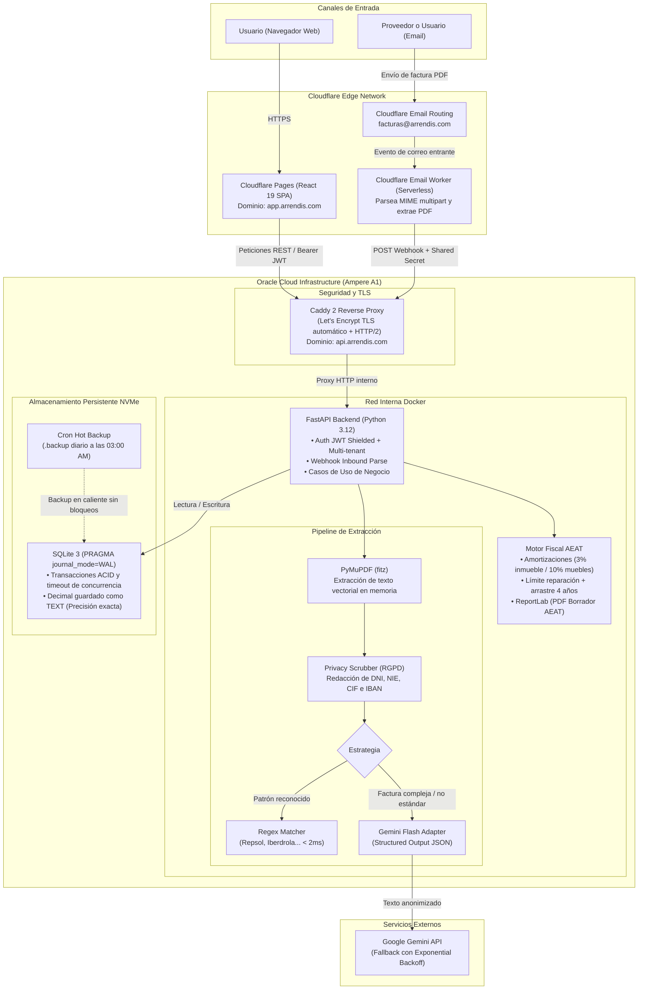
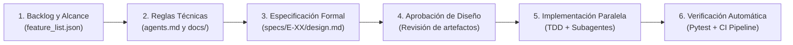

# Arrendis — Plataforma Integral de Gestión Patrimonial y Motor Fiscal AEAT

[](.github/workflows/deploy.yml)
[](tests/)
[](requirements.txt)
[](backend/)
[](frontend/)
[](#arquitectura-de-software-hexagonal-y-domain-driven-design)
[](#infraestructura-en-produccion-y-operaciones)

> **Arrendis** es una plataforma SaaS desarrollada para propietarios e inversores inmobiliarios particulares en España. Centraliza la administración de inmuebles, el seguimiento de contratos de arrendamiento, la ingesta automatizada de facturas de suministros y la liquidación del **IRPF inmobiliario (Modelo 100 AEAT)** mediante la generación de borradores fiscales oficiales.

---

## Resumen Ejecutivo

El proyecto está diseñado como un sistema en producción con foco en arquitectura desacoplada, modelado riguroso de normativas fiscales y optimización de costes operativos:

* **Arquitectura Hexagonal y DDD**: Dominio en Python puro sin dependencias de frameworks externos, con puertos tipados y adaptadores intercambiables.
* **Spec-Driven Development (SDD)**: Desarrollo orquestado mediante especificaciones formales (`specs/`), contratos arquitectónicos (`agents.md`) y puertas de control de diseño técnico antes de la implementación.
* **Procesamiento de Facturas con Cumplimiento RGPD**: Ingesta serverless por correo electrónico (`facturas@arrendis.com`), anonimización de datos personales mediante `PrivacyScrubber` y extracción híbrida (Regex determinista de menos de 2 ms con fallback a Google Gemini Flash para esquemas no estándar).
* **Motor Fiscal AEAT**: Modelado algorítmico de la normativa tributaria española: cálculo de amortizaciones (3% sobre el mayor valor entre adquisición y catastro, 10% en enseres), prorrateo por días de ocupación, límite de gastos de financiación y conservación con arrastre de excesos a 4 años, y reducciones de la Ley de Vivienda.
* **Infraestructura Cloud de Coste Cero**: Despliegue distribuido en Cloudflare Pages (Frontend SPA), Cloudflare Workers (Ingesta email), Caddy 2 (Reverse proxy con TLS automático) y Oracle Cloud Infrastructure Ampere VM (Backend en contenedores Docker) con SQLite en modo WAL y copias de seguridad en caliente.
* **Calidad y Verificación**: Suite de más de **350 pruebas automatizadas** (unitarias, integración y ciclo de vida E2E) integradas en un pipeline de CI/CD en GitHub Actions con despliegue automático por SSH.

---

## Arquitectura de Sistemas y Topología de Red

El siguiente diagrama detalla la interacción entre los clientes, la red perimetral de Cloudflare, la infraestructura de cómputo en Oracle Cloud y los servicios externos:



---

## Arquitectura de Software: Hexagonal y Domain-Driven Design

El backend implementa **Arquitectura Hexagonal (Ports and Adapters)** combinada con conceptos de **Domain-Driven Design (DDD)** para aislar la lógica de negocio de los mecanismos de entrega, almacenamiento y APIs externas.

```
backend/
├── domain/                  # Núcleo puro (sin dependencias de frameworks)
│   ├── entities.py          # Property, Expense, Income, LeaseContract, User
│   ├── value_objects.py     # Money, CadastralBreakdown, AcquisitionCost, FiscalReport
│   ├── services.py          # FiscalCalculator, ProfitCalculator, FiscalCategoryMapper
│   ├── extraction.py        # PrivacyScrubber, UtilityRegistry, RepsolStrategy
│   └── ports.py             # Interfaces abstractas: Repositorios, LLM, PDF, Renderers
├── application/             # Casos de uso (orquestación de flujos de negocio)
│   └── use_cases.py         # ProcessUtilityInvoice, CalculateFiscalReport, CreateExpense
├── adapters/                # Adaptadores de salida (infraestructura concreta)
│   ├── sqlite_adapter.py    # Conexión SQLite WAL, mapeo relacional parametrizado
│   ├── gemini_adapter.py    # Cliente Gemini con salida estructurada y reintentos
│   ├── pdf_extractor_adapter.py # Extracción vectorial en memoria con PyMuPDF
│   ├── aeat_pdf_renderer_adapter.py # Generación de informes tributarios con ReportLab
│   └── auth_adapter.py      # Cifrado Bcrypt y emisión de tokens JWT
└── api/                     # Adaptadores de entrada (capa de transporte web)
    ├── routes/              # Routers FastAPI (auth, properties, expenses, webhooks)
    ├── schemas.py           # Esquemas Pydantic v2 para validación de DTOs I/O
    └── dependencies.py      # Inyección de dependencias por ciclo de vida de petición
```

### Principios de diseño implementados:

1. **Inversión de Dependencias**: El módulo `domain/` define puertos como contratos abstractos (`ABC` de Python). Las capas externas (`adapters/` y `api/`) dependen del dominio, pero el dominio nunca depende de librerías de infraestructura, frameworks web o drivers de bases de datos.
2. **Value Objects Inmutables**: Modelos como `Money`, `Address`, `CadastralBreakdown` y `AcquisitionCost` utilizan `@dataclass(frozen=True)` con validaciones en constructor. Los cálculos monetarios emplean `Decimal` para evitar errores de coma flotante binaria.
3. **Multi-Tenancy y Aislamiento de Datos**: Cada consulta y mutación en los adaptadores de persistencia recibe y valida el `user_id` extraído del token JWT firmado, asegurando aislamiento total entre usuarios.

<details>
<summary><b>Definición de Puertos de Dominio (Python puro, sin dependencias externas)</b></summary>

```python
# backend/domain/ports.py
from abc import ABC, abstractmethod
from backend.domain.value_objects import LLMRequest, LLMResponse, FiscalReport

class LLMProviderPort(ABC):
    """Puerto genérico para interacción con Modelos de Lenguaje.
    El dominio abstrae el proveedor subyacente (Gemini, OpenAI o Mocks de test).
    """
    @abstractmethod
    def generate(self, request: LLMRequest) -> LLMResponse:
        """Genera una respuesta garantizando schema estructurado y reintentos exponenciales."""
        ...

class PDFTextExtractorPort(ABC):
    """Puerto para extracción de texto en documentos digitales."""
    @abstractmethod
    def extract_text(self, pdf_bytes: bytes) -> str:
        ...

class AEATReportRendererPort(ABC):
    """Puerto para rendering del informe oficial de la declaración."""
    @abstractmethod
    def render(self, report: FiscalReport, property_name: str, property_address: str) -> bytes:
        ...
```
</details>

---

## Metodología: Spec-Driven Development (SDD)

El desarrollo del proyecto se ejecutó mediante **Spec-Driven Development (SDD)** con **Antigravity CLI (`agy`)**.

Esta metodología sustituye la generación no controlada de código por un flujo de ingeniería estructurado donde el desarrollador actúa como arquitecto y validador del diseño técnico:



1. **Contrato Arquitectónico (`agents.md`)**: Reglas explícitas que prohíben dependencias de infraestructura en el dominio, fuerzan la separación de casos de uso y exigen pruebas unitarias antes de confirmar cambios.
2. **Especificación Previa (`specs/`)**: Cada funcionalidad cuenta con un documento de diseño técnico (diagramas de secuencia, invariantes y casos borde) redactado y revisado antes de escribir código ejecutable.
3. **Control de Aprobación**: Los planes de implementación generados por las herramientas de IA son inspeccionados y ajustados antes de su ejecución.
4. **Subagentes Especializados**: Tareas desacopladas (backend, frontend y testing) ejecutadas en paralelo respetando las firmas de los puertos tipados.

---

## Ingesta de Facturas y Extracción de Datos (RGPD)

La contabilización de facturas de suministros (electricidad y gas) opera mediante un pipeline optimizado para latencia mínima, coste reducido y estricto cumplimiento normativo:

1. **Ingesta Serverless en el Edge**:
   Un buzón de correo (`facturas@arrendis.com`) gestionado mediante Cloudflare Email Routing dispara un **Cloudflare Worker** que analiza el stream MIME, extrae el archivo PDF adjunto y lo transmite mediante un POST HTTPS con firma HMAC al endpoint de webhook de la API.
2. **Capa de Anonimización de Datos Personales (`PrivacyScrubber`)**:
   Antes de cualquier interacción con modelos de lenguaje externos, el servicio de dominio analiza el texto extraído por PyMuPDF y **redacta nombres, DNI, NIE, CIF y números de cuenta (IBAN)**:
   ```text
   Titular: [REDACTED_NIF] — IBAN: [REDACTED_IBAN]
   CUPS: ES0021000000000000AB — Total Factura: 142.35 EUR — Fecha: 12/04/2026
   ```
   Se preservan los metadatos técnicos y fiscales necesarios (identificador **CUPS**, importes y fechas) asegurando el principio de minimización de datos del RGPD.
3. **Estrategia Híbrida de Extracción**:
   * **Nivel 1 (Regex Determinista)**: Para comercializadoras con estructuras estables (ej. Repsol), un parser local procesa el texto en menos de **2 milisegundos**, con coste **0,00 $** y fiabilidad determinista.
   * **Nivel 2 (LLM Fallback con Gemini Flash)**: Para formatos no tabulados o distribuidores desconocidos, se delega en el adaptador de Gemini Flash solicitando salida JSON estructurada (*Structured Outputs* con validación Pydantic) y reintentos con retroceso exponencial (`tenacity`).

---

## Motor Fiscal: Liquidación del IRPF (Modelo 100 AEAT)

El servicio de dominio `FiscalCalculator` modela las reglas de cálculo aplicables a los Rendimientos del Capital Inmobiliario según la normativa de la Agencia Tributaria:

* **Amortización de Inmuebles (Art. 23.1.b LIRPF)**: Aplica el 3% anual sobre el mayor valor entre el coste de adquisición satisfecho (descontando el valor del suelo según el porcentaje catastral) y el valor catastral de la construcción, integrando de forma proporcional los gastos de compra (notaría, registro, ITP/IVA).
* **Amortización de Muebles y Enseres**: Computa el 10% anual para gastos de mobiliario e instalaciones de los últimos 10 ejercicios fiscales.
* **Límite de Gastos de Financiación y Reparación**: Los intereses hipotecarios y los gastos de conservación están limitados a los ingresos íntegros generados. El motor calcula el tope y **gestiona los excesos pendientes (carryforward) para su compensación en los 4 ejercicios posteriores**.
* **Prorrateo por Días de Ocupación**: Ajusta los gastos deducibles al número efectivo de días arrendados, con soporte para años bisiestos (366 días) y resolución de contratos solapados.
* **Reducciones de Rendimiento Neto**: Aplica el porcentaje de reducción general por arrendamiento de vivienda habitual (60%) o los tramos específicos de la Ley de Vivienda.
* **Generación de Borrador Oficial**: Adaptador con `ReportLab` que produce un documento PDF con la estructura de casillas del Modelo 100 de la AEAT.

---

## Estrategia de Testing

La suite de pruebas automatizadas con **pytest** cubre los diferentes niveles de la aplicación:

```
tests/
├── unit/
│   ├── backend/domain/       # Pruebas de entidades, VOs y servicios puros
│   │   ├── test_fiscal_calculator.py       # Casos límite de cálculo fiscal
│   │   ├── test_fiscal_value_objects.py    # Inmutabilidad y validaciones
│   │   ├── test_privacy_scrubber.py        # Anonimización RGPD
│   │   └── test_repsol_strategy.py         # Parsing determinista de facturas
│   ├── backend/application/  # Orquestación de casos de uso con mocks de puertos
│   └── backend/adapters/     # Pruebas de adaptadores concretos
└── integration/
    ├── backend/
    │   ├── test_process_utility_invoice_sqlite.py # Ingesta y persistencia
    │   └── test_repsol_pdf_extraction_empirical.py# Extracción sobre PDFs reales
    ├── test_e2e_fiscal_lifecycle.py          # Ciclo completo de cálculo anual
    └── test_e2e_carryforward_lifecycle.py    # Arrastre de excesos multianual
```

```bash
========================= 350 passed in 2.14s =========================
```

> **Aislamiento en Entornos de Integración Continua**: Las dependencias externas (Gemini API, servicios de terceros) están aisladas mediante puertos. Las 350 pruebas se ejecutan de forma local y en GitHub Actions sin necesidad de red externa ni consumo de cuotas de API.

---

## Infraestructura en Producción y Operaciones

El sistema opera bajo una arquitectura distribuida de **coste operativo mensual nulo (0,00 €/mes)**:

| Componente | Servicio / Tecnología | Función | Justificación Técnica |
| :--- | :--- | :--- | :--- |
| **Frontend SPA** | **Cloudflare Pages** | Hosting estático React 19 en CDN edge | Distribución global, latencia reducida y ancho de banda sin coste. |
| **Ingesta de Correo**| **Cloudflare Workers** | Ingesta serverless activada por evento SMTP | Procesamiento en el edge sin requerir un servidor de correo dedicado (Postfix). |
| **Reverse Proxy** | **Caddy 2 (Docker)** | Enrutamiento perimetral (`api.arrendis.com`) | Gestión y renovación automática de certificados TLS vía ACME/Let's Encrypt y HTTP/2. |
| **Cómputo Backend** | **Oracle Cloud Infrastructure** | VM Ampere ARM (Ubuntu 24.04, Docker) | Recursos dedicados de cómputo en capa gratuita permanente (*Always Free*). |
| **Base de Datos** | **SQLite 3 en NVMe** | Motor relacional con `WAL Mode` | Sin sobrecarga de red cliente-servidor; soporte para lecturas concurrentes y transacciones ACID. |
| **Recuperación ante Desastres** | **Cron Hot-Backup** | Script de respaldo nocturno con retención de 30 días | Copia atómica en caliente mediante el comando `.backup` de SQLite sin bloquear escrituras. |

### Pipeline de CI/CD (GitHub Actions)

El workflow [`.github/workflows/deploy.yml`](.github/workflows/deploy.yml) automatiza el ciclo de entrega ante cambios en la rama `main`:

1. **Fase de Integración Continua (CI)**:
   * **Backend**: Ejecución de la suite `pytest` en Python 3.12 con análisis de cobertura.
   * **Frontend**: Validación de tipos con TypeScript (`tsc -b`) y verificación de compilación de la SPA con Vite sobre Node.js 22.
2. **Fase de Despliegue Continuo (CD)**:
   * Conexión por SSH a la instancia de Oracle Cloud.
   * Actualización del repositorio (`git pull origin main`).
   * Reconstrucción y despliegue del contenedor backend (`docker compose -f cicd/docker-compose.prod.yml up -d --build backend`).

---

## Matriz de Decisiones Técnicas y Trade-Offs

| Decisión de Diseño | Alternativa Considerada | Justificación Técnica |
| :--- | :--- | :--- |
| **SQLite (WAL) en NVMe** | PostgreSQL Gestionado | Para el perfil de carga de gestión de carteras de alquiler individuales, una base de datos cliente-servidor introduce latencia de red y costes mensuales. SQLite en modo WAL ofrece cientos de lecturas concurrentes simultáneas y simplifica los respaldos a un único archivo atómico. |
| **Caddy 2** | Nginx + Certbot | Caddy automatiza la obtención y renovación de certificados TLS sin requerir cronjobs externos ni reinicios periódicos de configuración. |
| **Extractor Híbrido (Regex + LLM)** | Extracción exclusiva con LLM | Enviar todas las facturas a un LLM incrementa el consumo de tokens, introduce latencias de varios segundos y expone a alucinaciones. El parser regex procesa la mayoría de facturas en menos de 2 ms con fiabilidad absoluta. |
| **Dominio en Python Puro** | Modelos acoplados a ORMs (SQLAlchemy/Django) | Evitar el acoplamiento a ORMs previene la dispersión de lógica de negocio en callbacks y facilita pruebas unitarias inmediatas en milisegundos sin levantar bases de datos de prueba. |

---

## Entorno de Desarrollo Local

### Requisitos
* **Python 3.12+**
* **Node.js 22+**
* Clave de API de Google Gemini (opcional, requerida únicamente para facturas con formatos no estándar)

### 1. Clonación y preparación del entorno
```bash
git clone https://github.com/Carloscg02/arrendis.git
cd arrendis

# Configuración del entorno virtual Python
python3 -m venv venv
source venv/bin/activate
pip install -r requirements.txt

# Dependencias del frontend
cd frontend
npm install
cd ..
```

### 2. Variables de entorno
```bash
cp cicd/.env.example .env
```

### 3. Ejecución de servicios (Backend y Frontend)
El script [`start_local.sh`](start_local.sh) inicializa simultáneamente el backend en FastAPI y el servidor de desarrollo de Vite:

```bash
chmod +x start_local.sh
./start_local.sh
```

* **Frontend**: [http://localhost:5173](http://localhost:5173)
* **Backend API**: [http://localhost:8000/api](http://localhost:8000/api)
* **Documentación OpenAPI / Swagger**: [http://localhost:8000/docs](http://localhost:8000/docs)

### 4. Ejecución de la suite de pruebas
```bash
pytest -v
```

---

## Autor

**Carlos** — *Software Engineer*  
* GitHub: [@Carloscg02](https://github.com/Carloscg02)
