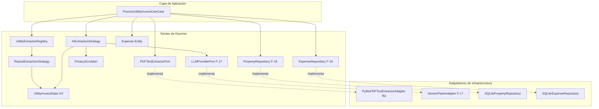

# 📐 Especificación Técnica — F-18: Motor de Extracción de Datos de Suministros

> **Feature:** F-18  
> **Título:** Motor de Extracción de Datos de Suministros (PyMuPDF + Strategy Pattern + Repsol Regex + Fallback LLM + Privacy Scrubber)  
> **Épica:** E-02 — Automatización de Gastos de Suministros vía Email  
> **Estado:** Implementada y validada con tests ✅ (31 tests específicos, 308 tests totales en suite)  
> **Fecha:** 2026-09-05  
> **Dependencias:** F-16 (Modelo de Dominio de Suministros) ✅, F-17 (Puerto y Adaptador Genérico de LLM) ✅  

---

## 1. Contexto y Objetivo

Esta feature implementa el **núcleo de extracción automatizada de datos de facturas de suministros** (luz, gas y agua) a partir de documentos PDF.

### ¿Qué problema resuelve?

Hasta ahora, registrar una factura de suministros requería que el propietario abriera el PDF, buscara visualmente el importe total, la fecha de emisión, el número de factura y el inmueble asociado, e introdujera cada dato manualmente en la aplicación.

Con **F-18**, el sistema automatiza este proceso mediante un pipeline inteligente de 5 etapas:
1. **Extracción vectorial de texto** desde el PDF mediante PyMuPDF (`fitz`), sin coste de OCR ni llamadas de red.
2. **Selección desacoplada de estrategia de extracción** según el principio de Abierto/Cerrado (*Open/Closed Principle* - OCP) mediante `UtilityExtractorRegistry`.
3. **Extracción determinista y ultrarrápida por Regex (Vía A)** para comercializadoras conocidas (iniciando con **Repsol Electricidad** a partir de la muestra real disponible).
4. **Fallback resiliente a IA Generativa (Vía B)** mediante `LLMProviderPort` (F-17) con `GeminiFlashAdapter` y JSON Schema estructurado para facturas desconocidas o fallos de Regex, pasando previamente por una capa obligatoria de **Scrubbing de Privacidad** conforme a la normativa GDPR/RGPD.
5. **Matching unívoco Inmueble-Factura** mediante el código **CUPS** (`PropertyRepository.find_by_cups()`) y persistencia del gasto en estado pendiente de revisión (`is_verified = False`, `source = AUTO_IMPORT`).

### ¿Qué NO es esta feature?

- No implementa la interfaz visual de subida de PDF ni el panel de confirmación (eso es **F-20**).
- No implementa la recepción automática de correos vía IMAP o Webhook (eso es **F-21**, diferido).
- No implementa el almacenamiento a largo plazo de los archivos PDF en Cloudflare R2 / S3 (eso es **F-19**, diferido).
- No implementa parsers Regex para otras comercializadoras más allá de Repsol en esta primera iteración (se añadirán incrementalmente gracias al OCP del `UtilityExtractorRegistry`).

---

## 2. Lenguaje Ubicuo (Términos Nuevos)

| Término | Definición | Ejemplo en el proyecto |
|---|---|---|
| **PDFTextExtractorPort** | Puerto de salida del dominio que define el contrato para extraer el texto plano ordenado de un PDF binario. | `extractor.extract_text(pdf_bytes)` |
| **PyMuPDFTextExtractorAdapter** | Adaptador de infraestructura que implementa `PDFTextExtractorPort` usando la librería `fitz` (PyMuPDF). | `PyMuPDFTextExtractorAdapter()` |
| **ExtractionStrategy** | Contrato de dominio (interfaz abstracta) que define la firma para procesar texto de facturas y extraer un `UtilityInvoiceData`. | `strategy.extract(raw_text)` |
| **RepsolExtractionStrategy** | Implementación concreta de `ExtractionStrategy` basada en expresiones regulares sobre el patrón de líneas de Repsol. | Extrae CUPS `ES0031103721971011PR0F`, importe `75.46 €`. |
| **AIExtractionStrategy** | Implementación concreta de `ExtractionStrategy` que actúa como fallback universal consumiendo `LLMProviderPort` (F-17). | Invoca Gemini 2.0 Flash con `response_schema` JSON. |
| **UtilityExtractorRegistry** | Registro central y desacoplado de estrategias de extracción que permite incorporar nuevas comercializadoras sin alterar casos de uso. | `registry.find_strategy(text)` |
| **PrivacyScrubber** | Servicio de dominio encargado de redactar/anonimizar datos personales (DNI, NIE, CIF, IBAN, nombres, direcciones) antes de enviar el texto al LLM. | Sustituye `53918290B` por `[REDACTED_NIF]`. |
| **ProcessUtilityInvoiceUseCase** | Caso de uso de la capa de aplicación que orquesta el pipeline completo de ingesta, extracción, matching y creación de gasto. | `use_case.execute(pdf_bytes, user_id)` |
| **ProcessUtilityInvoiceResult** | DTO inmutable que encapsula el resultado exitoso del pipeline: gasto creado, propiedad emparejada, metadatos y estrategia empleada. | `ProcessUtilityInvoiceResult(expense, property, ...)` |
| **PropertyNotFoundForCUPSError** | Excepción de dominio/aplicación lanzada cuando una factura es parseada con éxito pero el CUPS no pertenece a ninguna propiedad del usuario. | `PropertyNotFoundForCUPSError(cups="ES0031...")` |
| **ExtractionFailedError** | Excepción lanzada cuando ni la estrategia Regex ni el fallback a IA logran extraer datos válidos. | `ExtractionFailedError("No se pudo extraer...")` |

---

## 3. Arquitectura y Puertos/Adaptadores

### 3.1 Diagrama de Arquitectura Hexagonal



### 3.2 Árbol de Decisión del Pipeline de Extracción

```
┌─────────────────────────────────────────────────────────────┐
│               ProcessUtilityInvoiceUseCase                  │
│                                                             │
│  Entrada: pdf_bytes (bytes), user_id (str)                  │
└──────────────────────────────┬──────────────────────────────┘
                               │
                               ▼
        ┌─────────────────────────────────────────────┐
        │ 1. PDFTextExtractorPort (PyMuPDF / fitz)    │
        │    raw_text = extractor.extract_text(bytes) │
        └──────────────────────┬──────────────────────┘
                               │ ¿raw_text vacío?
                               ├─ SÍ ──► [Lanzar EmptyPDFTextError]
                               │
                               ▼ NO
        ┌─────────────────────────────────────────────┐
        │ 2. UtilityExtractorRegistry.find_strategy() │
        │    strategy = registry.find_strategy(text)  │
        └──────────────────────┬──────────────────────┘
                               │ ¿Existe estrategia Regex (ej. Repsol)?
                               ├─ SÍ
                               │   │
                               │   ▼
                               │ ┌──────────────────────────────────────┐
                               │ │ 3a. Ejecutar estrategia Regex        │
                               │ │     data = strategy.extract(text)    │
                               │ └──────────────────┬───────────────────┘
                               │                    │ ¿Extracción exitosa?
                               │                    ├─ SÍ ──► [data (Confidence: HIGH)] ──┐
                               │                    ▼ NO (o excepción)                    │
                               │                   (Log warning: regex falló)             │
                               │                    │                                     │
                               ▼ NO                 ▼                                     │
        ┌─────────────────────────────────────────────────────┐                           │
        │ 3b. Fallback Universal: AIExtractionStrategy        │                           │
        │                                                     │                           │
        │     1. scrubbed = PrivacyScrubber.scrub(text)       │                           │
        │     2. req = LLMRequest(prompt, schema=JSON_SCHEMA) │                           │
        │     3. res = llm_provider.generate(req)             │                           │
        │     4. data = parse(res.parsed_data, MEDIUM)        │                           │
        └──────────────────────┬──────────────────────────────┘                           │
                               │ ¿Extracción IA exitosa?                                  │
                               ├─ NO ──► [Lanzar ExtractionFailedError]                   │
                               │                                                          │
                               ▼ SÍ                                                       │
                     [data (Confidence: MEDIUM)] ─────────────────────────────────────────┤
                                                                                          │
                                                                                          ▼
        ┌─────────────────────────────────────────────────────────────────────────────────┐
        │ 4. Matching Inmueble por CUPS                                                   │
        │    property = property_repo.find_by_cups(cups=data.cups, user_id=user_id)       │
        └──────────────────────┬──────────────────────────────────────────────────────────┘
                               │ ¿property is None?
                               ├─ SÍ ──► [Lanzar PropertyNotFoundForCUPSError(data)]
                               │
                               ▼ NO
        ┌─────────────────────────────────────────────────────────────────────────────────┐
        │ 5. Creación y Persistencia del Gasto (Expense)                                  │
        │    expense = Expense(                                                           │
        │        property_id=property.id,                                                 │
        │        amount=Money(data.amount, "EUR"),                                        │
        │        date=data.issue_date,                                                    │
        │        category=ExpenseCategory.UTILITY,                                        │
        │        fiscal_category=FiscalExpenseCategory.SERVICIOS_SUMINISTROS,             │
        │        description="Suministro Repsol - Factura 61088387754",                   │
        │        is_verified=False,          # ← Pendiente de validación humana           │
        │        source=ExpenseSource.AUTO_IMPORT,                                        │
        │        utility_data=data,                                                       │
        │    )                                                                            │
        │    expense_repo.save(expense)                                                   │
        └──────────────────────┬──────────────────────────────────────────────────────────┘
                               │
                               ▼
        ┌─────────────────────────────────────────────────────────────────────────────────┐
        │ Retornar ProcessUtilityInvoiceResult(expense, property, data, strategy_name)    │
        └─────────────────────────────────────────────────────────────────────────────────┘
```

---

## 4. Especificación Detallada de Componentes

### 4.1 Puerto `PDFTextExtractorPort` y Adaptador `PyMuPDFTextExtractorAdapter`

#### 4.1.1 Puerto en el Dominio (`backend/domain/ports.py`)

```python
class PDFTextExtractorPort(ABC):
    """Puerto de salida para la extracción de texto plano desde archivos PDF binarios.
    
    El dominio define QUÉ necesita (texto del documento) sin atarse a ninguna
    librería concreta (PyMuPDF, PDFMiner, pypdf, etc.).
    """

    @abstractmethod
    def extract_text(self, pdf_bytes: bytes) -> str:
        """Extrae el contenido textual ordenado de las páginas del PDF.
        
        Args:
            pdf_bytes: Bytes del archivo PDF en memoria.
            
        Returns:
            Cadena de texto con el contenido concatenado de todas las páginas.
            
        Raises:
            EmptyPDFTextError: Si el archivo es válido pero no contiene texto vectorial.
            PDFExtractionError: Si el documento está corrupto o protegido por contraseña.
        """
        ...
```

#### 4.1.2 Adaptador en Infraestructura (`backend/adapters/pdf_extractor_adapter.py`)

```python
import fitz  # PyMuPDF
from backend.domain.ports import PDFTextExtractorPort
from backend.domain.entities import EmptyPDFTextError, PDFExtractionError

class PyMuPDFTextExtractorAdapter(PDFTextExtractorPort):
    """Adaptador que implementa PDFTextExtractorPort utilizando PyMuPDF (fitz).
    
    PyMuPDF realiza la extracción del árbol vectorial de texto en memoria
    con alto rendimiento (motor C++ MuPDF) y sin I/O en disco.
    """

    def extract_text(self, pdf_bytes: bytes) -> str:
        if not pdf_bytes:
            raise EmptyPDFTextError("El archivo PDF recibido está vacío (0 bytes).")

        try:
            doc = fitz.open(stream=pdf_bytes, filetype="pdf")
        except Exception as e:
            raise PDFExtractionError(f"No se pudo abrir el documento PDF: {e}") from e

        if doc.is_encrypted:
            raise PDFExtractionError("El documento PDF está protegido con contraseña.")

        pages_text: list[str] = []
        for page in doc:
            text = page.get_text("text")
            if text:
                pages_text.append(text)

        full_text = "\n".join(pages_text).strip()
        if not full_text:
            raise EmptyPDFTextError(
                "El documento PDF no contiene capa de texto digital. "
                "Es probable que sea una imagen escaneada que requiere OCR."
            )

        return full_text
```

---

### 4.2 Servicio de Dominio: `PrivacyScrubber` (Cumplimiento GDPR)

La Vía B envía fragmentos de texto al LLM en la nube. Según el **Artículo 5.1.c del RGPD (Principio de Minimización de Datos)**, solo deben tratarse los datos estrictamente necesarios para la finalidad de extracción.

El titular, su documento de identidad (DNI/NIE/CIF), su dirección postal y su número de cuenta bancaria **no son necesarios** para extraer el CUPS, el importe, la fecha, el proveedor y el tipo de suministro.

#### 4.2.1 Reglas de Anonimización

1. **DNI / NIE / CIF Españoles:**
   - DNI: 8 dígitos + 1 letra de control (`\b\d{8}[A-HJ-NP-TV-Z]\b`).
   - NIE: X, Y o Z + 7 dígitos + letra (`\b[XYZ]\d{7}[A-Z]\b`).
   - CIF: Letra de organización + 7 dígitos + dígito o letra de control (`\b[ABCDEFGHJNPQRSUVW]\d{7}[0-9A-J]\b`).
   - Reemplazo: `[REDACTED_NIF]`.
2. **Cuentas Bancarias e IBANs:**
   - IBAN español completo: `\bES\d{2}[\s\-]?\d{4}[\s\-]?\d{4}[\s\-]?\d{2}[\s\-]?\d{10}\b`.
   - Cuentas enmascaradas: `\*{1,4}\d{4}`.
   - Reemplazo: `[REDACTED_IBAN]`.
   - **Salvaguarda crítica:** El patrón de IBAN no debe capturar el CUPS (`ES` + 16-18 dígitos + caracteres alfanuméricos). El CUPS tiene entre 20 y 22 caracteres alfanuméricos directos sin los 2 dígitos de control bancario obligatorios tras `ES`.
3. **Etiquetas Contextuales de PII (Patrón etiqueta-valor en líneas consecutivas):**
   - `"Nombre y Apellidos del titular\n<nombre>"`
   - `"Esta es tu factura de luz,\n<nombre>"`
   - `"Dirección de suministro\n<dirección>"`
   - `"Dirección postal\n<dirección>"`
   - `"DNI\n<nif>"`
   - `"Cuenta bancaria\n<cuenta>"`
   - `"Localizador de pago\n<datos>"`
   - Reemplazo: La línea de valor subsiguiente se reemplaza por `[REDACTED_PII]`.

#### 4.2.2 Implementación (`backend/domain/extraction.py`)

```python
class PrivacyScrubber:
    """Servicio de dominio para anonimizar datos personales (PII) antes del envío a LLMs.
    
    Garantiza el principio de minimización de datos del RGPD conservando
    intactos los datos técnicos requeridos para la extracción (CUPS, importes, fechas).
    """

    _DNI_REGEX = re.compile(r'\b\d{8}[A-HJ-NP-TV-Z]\b', re.IGNORECASE)
    _NIE_REGEX = re.compile(r'\b[XYZ]\d{7}[A-Z]\b', re.IGNORECASE)
    _CIF_REGEX = re.compile(r'\b[ABCDEFGHJNPQRSUVW]\d{7}[0-9A-J]\b', re.IGNORECASE)
    _IBAN_REGEX = re.compile(r'\bES\d{2}[\s\-]?(?:\d{4}[\s\-]?){4}\d{2}\b', re.IGNORECASE)
    _MASKED_ACCOUNT_REGEX = re.compile(r'\*{1,4}\d{4}')

    _PII_HEADER_PATTERNS = [
        re.compile(r'^Nombre y Apellidos.*', re.IGNORECASE),
        re.compile(r'^Esta es tu factura de.*', re.IGNORECASE),
        re.compile(r'^Dirección de suministro.*', re.IGNORECASE),
        re.compile(r'^Dirección postal.*', re.IGNORECASE),
        re.compile(r'^DNI\b', re.IGNORECASE),
        re.compile(r'^Cuenta bancaria\b', re.IGNORECASE),
        re.compile(r'^Localizador de pago\b', re.IGNORECASE),
    ]

    @classmethod
    def scrub(cls, raw_text: str) -> str:
        """Anonimiza PII en el texto respetando los datos técnicos y fiscales."""
        lines = raw_text.splitlines()
        scrubbed_lines: list[str] = []
        redact_next = False

        for line in lines:
            stripped = line.strip()

            if redact_next:
                scrubbed_lines.append("[REDACTED_PII]")
                redact_next = False
                continue

            # Comprobar si la línea es un encabezado de PII
            is_pii_header = any(pat.match(stripped) for pat in cls._PII_HEADER_PATTERNS)
            if is_pii_header:
                scrubbed_lines.append(stripped)
                redact_next = True
                continue

            # Redactar patrones inline
            processed = cls._DNI_REGEX.sub("[REDACTED_NIF]", stripped)
            processed = cls._NIE_REGEX.sub("[REDACTED_NIF]", processed)
            processed = cls._CIF_REGEX.sub("[REDACTED_NIF]", processed)
            processed = cls._IBAN_REGEX.sub("[REDACTED_IBAN]", processed)
            processed = cls._MASKED_ACCOUNT_REGEX.sub("[REDACTED_IBAN]", processed)

            scrubbed_lines.append(processed)

        return "\n".join(scrubbed_lines)
```

---

### 4.3 Contrato de Estrategia de Extracción: `ExtractionStrategy`

```python
class ExtractionStrategy(ABC):
    """Contrato base para cualquier estrategia de extracción de facturas de suministros."""

    @property
    @abstractmethod
    def provider_name(self) -> str:
        """Nombre canónico del proveedor o estrategia (ej. 'Repsol', 'AI_Fallback')."""
        ...

    @abstractmethod
    def can_handle(self, text: str) -> bool:
        """Determina si esta estrategia reconoce el formato del texto de la factura."""
        ...

    @abstractmethod
    def extract(self, text: str) -> UtilityInvoiceData | None:
        """Extrae los datos estructurados del texto.
        
        Returns:
            UtilityInvoiceData si todos los campos requeridos se extrajeron correctamente.
            None si la extracción no fue concluyente o falló la validación.
        """
        ...
```

---

### 4.4 Estrategia Regex para Repsol: `RepsolExtractionStrategy`

Basada en el análisis empírico de la factura de muestra [`factura_ejemplo_1.pdf`](file:///home/carlos/rental-handler/specs/epics/E-02-suministros/samples/factura_ejemplo_1.pdf):

```python
class RepsolExtractionStrategy(ExtractionStrategy):
    """Estrategia de extracción por Regex optimizada para facturas de Repsol.
    
    Analiza la estructura secuencial etiqueta -> valor que genera PyMuPDF en las
    facturas de Repsol Comercializadora de Electricidad y Gas, S.L.U.
    """

    @property
    def provider_name(self) -> str:
        return "Repsol"

    def can_handle(self, text: str) -> bool:
        """Detecta menciones a Repsol en el texto de la factura."""
        return bool(re.search(r'\bREPSOL\b', text, re.IGNORECASE))

    def extract(self, text: str) -> UtilityInvoiceData | None:
        try:
            # 1. CUPS
            cups_match = re.search(r'CUPS\s*\n\s*(ES\d{16,18}[A-Z0-9]{0,4})', text, re.IGNORECASE)
            if not cups_match:
                return None
            cups = cups_match.group(1).strip().upper()

            # 2. Total Factura
            total_match = re.search(r'Total factura\s*\n\s*([\d.,]+)\s*€', text, re.IGNORECASE)
            if not total_match:
                return None
            amount_str = total_match.group(1).strip().replace('.', '').replace(',', '.')
            amount = Decimal(amount_str)

            # 3. Fecha de emisión
            date_match = re.search(r'Fecha de emisión\s*\n\s*(\d{2}/\d{2}/\d{4})', text, re.IGNORECASE)
            if not date_match:
                return None
            issue_date = datetime.strptime(date_match.group(1).strip(), "%d/%m/%Y").date()

            # 4. Número de factura
            inv_match = re.search(r'Nº de factura\s*\n\s*([A-Za-z0-9]+)', text, re.IGNORECASE)
            invoice_number = inv_match.group(1).strip() if inv_match else None

            # 5. Tipo de suministro
            utility_type = UtilityType.ELECTRICITY
            if re.search(r'factura de gas', text, re.IGNORECASE):
                utility_type = UtilityType.GAS

            return UtilityInvoiceData(
                cups=cups,
                amount=amount,
                issue_date=issue_date,
                provider_name="Repsol Comercializadora de Electricidad y Gas, S.L.U.",
                utility_type=utility_type,
                invoice_number=invoice_number,
                extraction_confidence=ExtractionConfidence.HIGH,
            )
        except Exception:
            return None
```

---

### 4.5 Estrategia IA (Fallback Universal): `AIExtractionStrategy`

```python
class AIExtractionStrategy(ExtractionStrategy):
    """Estrategia de extracción resiliente basada en LLM (Gemini Flash vía LLMProviderPort).
    
    Se invoca cuando:
    - La factura proviene de una comercializadora no registrada en el registry.
    - La estrategia Regex específica falló (diseño del PDF modificado, etc.).
    """

    SYSTEM_PROMPT = """Eres un asistente contable experto en facturas de suministros españoles (luz, gas y agua).
Tu objetivo es extraer con máxima precisión los siguientes campos de la factura proporcionada:
- cups: Código Unificado de Punto de Suministro (formato español: ES + 16-18 dígitos + caracteres alfanuméricos).
- amount: Importe total de la factura a pagar en euros (número decimal positivo).
- issue_date: Fecha de emisión de la factura en formato ISO (YYYY-MM-DD).
- provider_name: Nombre de la empresa comercializadora o suministradora.
- utility_type: Tipo de suministro ('electricity', 'gas' o 'water').
- invoice_number: Número identificativo de la factura (opcional).

Si algún campo no está explícito pero se deduce unívocamente, extráelo. Si no encuentras el CUPS o el importe total, responde con null en dicho campo.
"""

    RESPONSE_SCHEMA = {
        "type": "object",
        "properties": {
            "cups": {"type": "string", "description": "CUPS de la factura"},
            "amount": {"type": "number", "description": "Importe total en euros"},
            "issue_date": {"type": "string", "description": "Fecha de emisión en formato YYYY-MM-DD"},
            "provider_name": {"type": "string", "description": "Nombre de la comercializadora"},
            "utility_type": {"type": "string", "enum": ["electricity", "gas", "water"]},
            "invoice_number": {"type": "string", "description": "Número de factura"},
        },
        "required": ["cups", "amount", "issue_date", "provider_name", "utility_type"],
    }

    def __init__(self, llm_provider: LLMProviderPort) -> None:
        self._llm = llm_provider

    @property
    def provider_name(self) -> str:
        return "AI_Fallback"

    def can_handle(self, text: str) -> bool:
        return True  # Universal

    def extract(self, text: str) -> UtilityInvoiceData | None:
        # 1. Aplicar Scrubbing de Privacidad GDPR
        scrubbed_text = PrivacyScrubber.scrub(text)

        # 2. Petición estructurada al LLM
        request = LLMRequest(
            user_prompt=f"Extrae los datos de esta factura:\n\n{scrubbed_text}",
            system_prompt=self.SYSTEM_PROMPT,
            response_schema=self.RESPONSE_SCHEMA,
            temperature=0.0,
            max_output_tokens=1024,
        )

        try:
            response = self._llm.generate(request)
            data = response.parsed_data
            if not data or not data.get("cups") or not data.get("amount"):
                return None

            return UtilityInvoiceData(
                cups=data["cups"].strip().upper(),
                amount=Decimal(str(data["amount"])),
                issue_date=date.fromisoformat(data["issue_date"]),
                provider_name=data["provider_name"].strip(),
                utility_type=UtilityType(data["utility_type"].lower()),
                invoice_number=data.get("invoice_number"),
                extraction_confidence=ExtractionConfidence.MEDIUM,
            )
        except Exception:
            return None
```

---

### 4.6 Registro Desacoplado: `UtilityExtractorRegistry` (Open/Closed Principle)

```python
class UtilityExtractorRegistry:
    """Registro extensible de estrategias de extracción de facturas.
    
    Cumple el principio Open/Closed (OCP):
    - Abierto para extensión: Para soportar Endesa, Iberdrola o Aqualia solo hay que
      implementar una nueva ExtractionStrategy y registrarla con register().
    - Cerrado para modificación: Ni el caso de uso ni las estrategias existentes
      se alteran al incorporar nuevos proveedores.
    """

    def __init__(self, strategies: list[ExtractionStrategy] | None = None) -> None:
        self._strategies: list[ExtractionStrategy] = list(strategies or [])

    def register(self, strategy: ExtractionStrategy) -> None:
        """Añade una nueva estrategia al registro."""
        self._strategies.append(strategy)

    def find_strategy(self, text: str) -> ExtractionStrategy | None:
        """Retorna la primera estrategia cuyo can_handle() devuelva True."""
        for strategy in self._strategies:
            if strategy.can_handle(text):
                return strategy
        return None

    @property
    def registered_providers(self) -> list[str]:
        return [s.provider_name for s in self._strategies]
```

---

### 4.7 Caso de Uso: `ProcessUtilityInvoiceUseCase`

```python
@dataclass(frozen=True)
class ProcessUtilityInvoiceResult:
    """DTO de resultado de la ingesta y extracción de una factura."""
    expense: Expense
    property: Property
    invoice_data: UtilityInvoiceData
    strategy_used: str

class ProcessUtilityInvoiceUseCase:
    """Caso de uso: procesar una factura PDF, extraer sus datos y registrar el gasto pendiente."""

    def __init__(
        self,
        pdf_extractor: PDFTextExtractorPort,
        registry: UtilityExtractorRegistry,
        property_repo: PropertyRepository,
        expense_repo: ExpenseRepository,
        fallback_strategy: ExtractionStrategy | None = None,
    ) -> None:
        self._pdf_extractor = pdf_extractor
        self._registry = registry
        self._property_repo = property_repo
        self._expense_repo = expense_repo
        self._fallback_strategy = fallback_strategy

    def execute(self, pdf_bytes: bytes, user_id: str) -> ProcessUtilityInvoiceResult:
        # 1. Extraer texto plano con PyMuPDF
        raw_text = self._pdf_extractor.extract_text(pdf_bytes)

        # 2. Intentar estrategia Regex según comercializadora
        invoice_data: UtilityInvoiceData | None = None
        strategy_used = "unknown"
        strategy = self._registry.find_strategy(raw_text)

        if strategy is not None:
            invoice_data = strategy.extract(raw_text)
            if invoice_data is not None:
                strategy_used = strategy.provider_name

        # 3. Fallback a IA si no hubo coincidencia Regex o falló la extracción
        if invoice_data is None:
            if self._fallback_strategy is None:
                raise ExtractionFailedError(
                    "No se pudo extraer la factura con reglas Regex y no hay estrategia de IA configurada."
                )
            invoice_data = self._fallback_strategy.extract(raw_text)
            if invoice_data is None:
                raise ExtractionFailedError(
                    "La extracción de la factura no pudo completarse ni por Regex ni por IA."
                )
            strategy_used = self._fallback_strategy.provider_name

        # 4. Matching unívoco CUPS -> Property del usuario
        prop = self._property_repo.find_by_cups(invoice_data.cups, user_id=user_id)
        if prop is None:
            raise PropertyNotFoundForCUPSError(
                f"No se encontró ningún inmueble del usuario con el CUPS '{invoice_data.cups}'.",
                cups=invoice_data.cups,
                invoice_data=invoice_data,
            )

        # 5. Crear Expense en estado no verificado (AUTO_IMPORT)
        expense = Expense(
            property_id=prop.id,
            amount=Money(invoice_data.amount, "EUR"),
            date=invoice_data.issue_date,
            category=ExpenseCategory.UTILITY,
            description=f"Factura {invoice_data.provider_name} - {invoice_data.invoice_number or invoice_data.cups}",
            fiscal_category=FiscalExpenseCategory.SERVICIOS_SUMINISTROS,
            is_verified=False,
            source=ExpenseSource.AUTO_IMPORT,
            utility_data=invoice_data,
        )

        # 6. Persistir el gasto
        self._expense_repo.save(expense)

        return ProcessUtilityInvoiceResult(
            expense=expense,
            property=prop,
            invoice_data=invoice_data,
            strategy_used=strategy_used,
        )
```

---

### 4.8 Excepciones de Dominio

```python
class UtilityExtractionError(Exception):
    """Clase base para errores en el motor de extracción de suministros."""
    pass

class EmptyPDFTextError(UtilityExtractionError):
    """El PDF está vacío o no contiene capa de texto vectorial digital."""
    pass

class PDFExtractionError(UtilityExtractionError):
    """Error al abrir o decodificar el archivo PDF."""
    pass

class ExtractionFailedError(UtilityExtractionError):
    """Ni Regex ni IA lograron extraer los campos mínimos obligatorios."""
    pass

class PropertyNotFoundForCUPSError(UtilityExtractionError):
    """Los datos fueron extraídos pero el CUPS no está registrado en los inmuebles del usuario."""
    def __init__(self, message: str, cups: str, invoice_data: UtilityInvoiceData) -> None:
        super().__init__(message)
        self.cups = cups
        self.invoice_data = invoice_data
```

---

## 5. Especificación de Tests

### 5.1 Tests Unitarios — Servicios de Dominio y Estrategias

| ID | Archivo | Qué verifica |
|---|---|---|
| **UT-F18-01** | `test_privacy_scrubber.py` | Redacta DNI español (`53918290B` → `[REDACTED_NIF]`). |
| **UT-F18-02** | `test_privacy_scrubber.py` | Redacta NIE y CIF sin tocar identificadores numéricos ordinarios. |
| **UT-F18-03** | `test_privacy_scrubber.py` | Redacta cuenta enmascarada (`*3940` → `[REDACTED_IBAN]`) e IBAN completo. |
| **UT-F18-04** | `test_privacy_scrubber.py` | **No altera el CUPS** (`ES0031103721971011PR0F` permanece intacto). |
| **UT-F18-05** | `test_privacy_scrubber.py` | Redacta línea subsiguiente a encabezados de PII (`Nombre y Apellidos`, `Dirección de suministro`). |
| **UT-F18-06** | `test_privacy_scrubber.py` | Preserva importes en euros (`75,46 €`) y fechas (`01/08/2026`). |
| **UT-F18-07** | `test_repsol_strategy.py` | `can_handle()` retorna `True` si el texto menciona "Repsol" (ignora mayúsculas/minúsculas). |
| **UT-F18-08** | `test_repsol_strategy.py` | `can_handle()` retorna `False` si el texto es de Endesa o Iberdrola. |
| **UT-F18-09** | `test_repsol_strategy.py` | Extrae correctamente CUPS, importe, fecha, nº factura y utility_type desde texto Repsol. |
| **UT-F18-10** | `test_repsol_strategy.py` | Asigna `extraction_confidence = HIGH`. |
| **UT-F18-11** | `test_repsol_strategy.py` | Retorna `None` si falta el CUPS o el importe total. |
| **UT-F18-12** | `test_utility_registry.py` | `register()` almacena la estrategia y actualiza `registered_providers`. |
| **UT-F18-13** | `test_utility_registry.py` | `find_strategy()` retorna la estrategia adecuada según `can_handle()`. |
| **UT-F18-14** | `test_utility_registry.py` | `find_strategy()` retorna `None` si ninguna estrategia coincide. |
| **UT-F18-15** | `test_ai_strategy.py` | Anonimiza el texto con `PrivacyScrubber` antes de llamar a `LLMProviderPort.generate()`. |
| **UT-F18-16** | `test_ai_strategy.py` | Construye `UtilityInvoiceData` con `extraction_confidence = MEDIUM` a partir de `parsed_data`. |
| **UT-F18-17** | `test_ai_strategy.py` | Retorna `None` si el LLM devuelve datos nulos o inválidos. |

### 5.2 Tests Unitarios — Caso de Uso (`ProcessUtilityInvoiceUseCase`)

| ID | Archivo | Qué verifica |
|---|---|---|
| **UT-F18-18** | `test_process_utility_invoice_use_case.py` | Vía A exitosa: Ejecuta Repsol regex, encuentra propiedad por CUPS y guarda Expense (`is_verified=False`, `HIGH`). |
| **UT-F18-19** | `test_process_utility_invoice_use_case.py` | Fallback a Vía B: Regex falla, IA exitosa, guarda Expense (`is_verified=False`, `MEDIUM`). |
| **UT-F18-20** | `test_process_utility_invoice_use_case.py` | Fallback a Vía B: Proveedor desconocido (no está en registry), invoca directamente IA. |
| **UT-F18-21** | `test_process_utility_invoice_use_case.py` | Error total: Regex falla y no hay IA configurada → Lanza `ExtractionFailedError`. |
| **UT-F18-22** | `test_process_utility_invoice_use_case.py` | Error total: Regex falla e IA falla → Lanza `ExtractionFailedError`. |
| **UT-F18-23** | `test_process_utility_invoice_use_case.py` | CUPS no asignado: Factura válida pero CUPS no coincide con inmueble del usuario → Lanza `PropertyNotFoundForCUPSError`. |
| **UT-F18-24** | `test_process_utility_invoice_use_case.py` | Multi-tenancy: CUPS existe en BD pero pertenece a otro usuario → Lanza `PropertyNotFoundForCUPSError`. |
| **UT-F18-25** | `test_process_utility_invoice_use_case.py` | PDF vacío: Lanza `EmptyPDFTextError`. |

### 5.3 Tests de Integración y Pruebas Empíricas

| ID | Archivo | Qué verifica |
|---|---|---|
| **IT-F18-01** | `test_repsol_pdf_extraction_empirical.py` | **Test Empírico Principal:** Lee directamente `specs/epics/E-02-suministros/samples/factura_ejemplo_1.pdf` con `PyMuPDFTextExtractorAdapter`, ejecuta `RepsolExtractionStrategy` y verifica exactamente: CUPS `ES0031103721971011PR0F`, importe `Decimal("75.46")`, fecha `date(2026, 8, 1)`, nº factura `61088387754`, tipo `ELECTRICITY`, confianza `HIGH`. |
| **IT-F18-02** | `test_process_utility_invoice_sqlite.py` | Pipeline completo con SQLite: Inserta Property con `cups_electricity="ES0031103721971011PR0F"`, ejecuta el caso de uso sobre la muestra real, consulta `expense_repo` y comprueba que el gasto persiste con todos sus atributos y `is_verified=0`. |
| **IT-F18-03** | `test_pdf_extractor_adapter.py` | El adaptador extrae texto no vacío de un PDF vectorial válido y lanza `EmptyPDFTextError` ante bytes corruptos o sin texto. |

---

## 6. Plan de Archivos a Crear y Modificar

### 6.1 Archivos a Crear

| Archivo | Capa | Responsabilidad |
|---|---|---|
| `backend/domain/extraction.py` | Dominio | `ExtractionStrategy` (base), `UtilityExtractorRegistry`, `RepsolExtractionStrategy`, `AIExtractionStrategy`, `PrivacyScrubber`. |
| `backend/adapters/pdf_extractor_adapter.py` | Infraestructura | `PyMuPDFTextExtractorAdapter` (implementa `PDFTextExtractorPort`). |
| `tests/unit/backend/domain/test_privacy_scrubber.py` | Tests | UT-F18-01 a UT-F18-06 (Privacidad GDPR). |
| `tests/unit/backend/domain/test_repsol_strategy.py` | Tests | UT-F18-07 a UT-F18-11 (Regex Repsol). |
| `tests/unit/backend/domain/test_utility_registry.py` | Tests | UT-F18-12 a UT-F18-14 (Registry OCP). |
| `tests/unit/backend/domain/test_ai_extraction_strategy.py` | Tests | UT-F18-15 a UT-F18-17 (Fallback IA). |
| `tests/unit/backend/application/test_process_utility_invoice_use_case.py` | Tests | UT-F18-18 a UT-F18-25 (Caso de Uso completo). |
| `tests/integration/backend/test_repsol_pdf_extraction_empirical.py` | Tests | IT-F18-01 (Prueba empírica muestra real Repsol). |
| `tests/integration/backend/test_process_utility_invoice_sqlite.py` | Tests | IT-F18-02 (Integración completa con BD). |
| `tests/unit/backend/adapters/test_pdf_extractor_adapter.py` | Tests | IT-F18-03 (Adaptador PyMuPDF). |

### 6.2 Archivos a Modificar

| Archivo | Capa | Modificación |
|---|---|---|
| `backend/domain/ports.py` | Dominio | Declarar `PDFTextExtractorPort`. |
| `backend/domain/entities.py` | Dominio | Declarar excepciones de extracción: `UtilityExtractionError`, `EmptyPDFTextError`, `PDFExtractionError`, `ExtractionFailedError`, `PropertyNotFoundForCUPSError`. |
| `backend/application/use_cases.py` | Aplicación | Añadir `ProcessUtilityInvoiceUseCase` y DTO `ProcessUtilityInvoiceResult`. |

---

## 7. Reglas de Arquitectura y Buenas Prácticas

- ✅ **Aislamiento Hexagonal Puro:** `PDFTextExtractorPort` vive en el dominio; PyMuPDF (`fitz`) vive **exclusivamente** en `adapters/pdf_extractor_adapter.py`. Ni el dominio ni la aplicación importan `fitz`.
- ✅ **Principio de Abierto/Cerrado (OCP):** El registro `UtilityExtractorRegistry` permite sumar comercializadoras futuras (Endesa, Naturgy, Iberdrola, Aqualia) registrando clases concretas sin modificar el orquestador `ProcessUtilityInvoiceUseCase`.
- ✅ **Privacidad GDPR Garantizada:** Ningún texto en bruto se envía al LLM en la nube sin haber pasado previamente por `PrivacyScrubber.scrub()`.
- ✅ **Multi-tenancy Estricto:** El matching `find_by_cups(cups, user_id)` siempre incluye el `user_id` de la sesión autenticada. Nunca se empareja una factura con la propiedad de otro usuario.
- ✅ **Human-in-the-Loop:** Todo gasto importado automáticamente nace con `is_verified = False`, impidiendo que compute en liquidaciones fiscales o cálculos de rentabilidad neta hasta su validación humana explícita.

---

## 8. 📚 El Rincón del Estudiante

### 🎯 ¿Por qué el Patrón Estrategia + Registro (Strategy + Registry) respeta el Principio Open/Closed (OCP)?

El segundo principio SOLID (**Open/Closed Principle**) dice: *"El software debe estar abierto para su extensión, pero cerrado para su modificación"*.

#### El Anti-patrón: La gran cadena `if / elif / else`

```python
# ❌ Anti-patrón: Modificar el caso de uso central cada vez que entra una factura nueva
class ProcessUtilityInvoiceUseCase:
    def execute(self, text: str):
        if "REPSOL" in text:
            return self.parse_repsol(text)
        elif "ENDESA" in text:
            return self.parse_endesa(text)
        elif "IBERDROLA" in text:
            return self.parse_iberdrola(text)
        # Cada compañía nueva requiere abrir y tocar este archivo central...
```

Si tenemos 15 comerciales en España, este archivo crecerá sin control y cada cambio correrá el riesgo de romper comercializadoras existentes.

#### La Solución Elegante: Strategy + Registry

1. Cada comercializadora es una clase autónoma que implementa `ExtractionStrategy`.
2. El registro `UtilityExtractorRegistry` almacena las estrategias disponibles.
3. El caso de uso consulta al registro de forma polimórfica: `registry.find_strategy(text)`.

```
                ┌──────────────────────────────┐
                │     ExtractionStrategy       │ (Interfaz)
                └──────────────┬───────────────┘
                               │
         ┌─────────────────────┼─────────────────────┐
         ▼                     ▼                     ▼
┌──────────────────┐  ┌──────────────────┐  ┌──────────────────┐
│ RepsolStrategy   │  │  EndesaStrategy  │  │ IberdrolaStrategy│
│ (implementada)   │  │   (futura F-X)   │  │   (futura F-Y)   │
└──────────────────┘  └──────────────────┘  └──────────────────┘
```

Cuando un usuario aporte una factura de Endesa en el futuro:
- No tocamos ni una sola línea de código existente.
- Creamos `EndesaExtractionStrategy` y la registramos: `registry.register(EndesaExtractionStrategy())`.

---

### 🛡️ ¿Qué es el Patrón Fallback y por qué es el estándar en arquitecturas de IA aplicada?

Un sistema que dependa **100% de Regex** es rápido y barato, pero **frágil**: un cambio menor en el diseño del PDF romperá la extracción.  
Un sistema que dependa **100% de IA** es flexible, pero **caro, lento y dependiente de la red**: pagarás API tokens y sufrirás latencias de 2-4 segundos en facturas que podrían resolverse en 2 milisegundos con Regex.

El **Patrón Fallback** combina lo mejor de ambos mundos:

```
Factura Entrante
       │
       ▼
[Intento Vía A: Regex Local] ──────── (Éxito) ───────► Resultado (0 ms, $0, Privacidad Total)
       │
    (Falla)
       │
       ▼
[Intento Vía B: Fallback IA] ──────── (Éxito) ───────► Resultado (2000 ms, cuota free, Resiliencia 100%)
```

- El **90% de las facturas recurrentes** se procesan en la Vía A a coste cero y latencia cero.
- El **10% restante** (compañías raras, rediseños) cae suavemente en la Vía B sin que el usuario perciba un error.

---

### ⚖️ GDPR y Minimización de Datos: ¿Por qué no podemos enviar el PDF completo a un LLM?

El **Artículo 5.1.c del Reglamento General de Protección de Datos (RGPD / GDPR)** establece el principio de *minimización de datos*: los datos personales deben ser *"adecuados, pertinentes y limitados a lo necesario en relación con los fines para los que son tratados"*.

Además, los modelos de IA en la nube (como Gemini Flash Free Tier) pueden procesar los prompts en servidores internacionales o utilizarlos para reentrenamiento según los términos del servicio.

| Dato en la Factura | ¿Relevante para registrar el gasto? | Acción de `PrivacyScrubber` |
|---|---|---|
| DNI / NIE del inquilino | ❌ No | Reemplazado por `[REDACTED_NIF]` |
| Nombre y apellidos del titular | ❌ No | Reemplazado por `[REDACTED_PII]` |
| Dirección postal particular | ❌ No | Reemplazado por `[REDACTED_PII]` |
| Cuenta bancaria / IBAN | ❌ No | Reemplazado por `[REDACTED_IBAN]` |
| Código CUPS del suministro | ✅ SÍ (necesario para matching) | **Conservado intacto** |
| Importe total de la factura | ✅ SÍ (necesario para contabilidad) | **Conservado intacto** |
| Fecha de emisión | ✅ SÍ (necesario para ejercicio fiscal) | **Conservado intacto** |
| Nombre de comercializadora | ✅ SÍ (necesario para descripción) | **Conservado intacto** |

El `PrivacyScrubber` actúa como un **cortafuegos de privacidad**: el LLM solo recibe datos técnicos de suministro, garantizando cumplimiento normativo total sin perder capacidad de extracción.

---

### 📄 PyMuPDF vs OCR: ¿Por qué extraer texto vectorial y no usar visión por computador?

En procesamiento de documentos existen dos categorías muy distintas de archivos:
1. **Documentos electrónicos vectoriales:** Creados digitalmente por el software de facturación de la comercializadora. El texto no son píxeles, sino secuencias de fuentes y caracteres tipográficos almacenados en el PDF.
2. **Documentos escaneados o fotográficos:** Píxeles rasterizados sin información textual semántica.

PyMuPDF (`fitz`) accede directamente a las estructuras tipográficas del PDF vectorial.
- **Rendimiento:** ~10 milisegundos por documento frente a ~1.500 milisegundos de un motor OCR (Tesseract / EasyOCR).
- **Consumo de memoria y CPU:** Mínimo; no requiere modelos de visión ni aceleración por GPU.
- **Precisión:** 100% libre de errores tipográficos comunes de OCR (confusión entre `0` y `O`, `1` y `l`, etc.), lo cual es crítico para identificadores de 20 caracteres como el CUPS.
