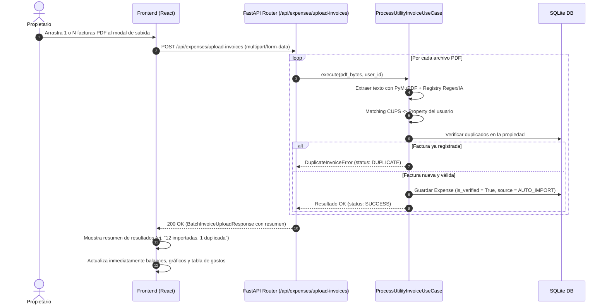

# 📐 Especificación Técnica — F-20: Subida de Facturas de Suministros (Individual y por Lotes) y Contabilización Directa

> **Feature:** F-20  
> **Título:** Interfaz UI: Subida de Facturas PDF (Individual y Lotes), Deduplicación y Contabilización Directa  
> **Épica:** E-02 — Automatización de Gastos de Suministros vía Email  
> **Estado:** Paso 1 — Especificación Técnica  
> **Fecha:** 2026-09-05  
> **Dependencias:** F-16 (Modelo de Dominio: CUPS) ✅, F-17 (Puerto LLM) ✅, F-18 (Motor de Extracción PyMuPDF + Strategy) ✅  
> **Normativa de diseño:** Directrices de alta artesanía de [`.agent/skills/anti-slop-ui/SKILL.md`](file:///home/carlos/rental-handler/.agent/skills/anti-slop-ui/SKILL.md)  

---

## 1. Contexto y Objetivo

Tras culminar la implementación del motor de extracción en **F-18** (capaz de extraer en memoria los datos de facturas PDF mediante Regex y fallback de IA anonimizada), la feature **F-20** construye la **experiencia de usuario directa y sin fricción ("Subir y Olvidarse")**.

### ¿Qué problema resuelve?

1. **Ingesta ágil individual o por lotes (Batch Upload):** Permite al propietario arrastrar una sola factura o **múltiples PDFs simultáneamente** (por ejemplo, las 12 facturas de luz de todo el año anterior para la declaración del IRPF).
2. **Contabilización Directa e Inmediata:** El gasto se registra directamente como **verificado y activo (`is_verified = True`)**, actualizando en tiempo real el beneficio neto, la rentabilidad y el borrador fiscal de la propiedad sin forzar al usuario a validar o confirmar los gastos uno a uno.
3. **Protección Activa contra Facturas Duplicadas (Idempotencia):** Si el usuario sube dos veces el mismo archivo por accidente o si en el futuro la automatización de correo ya procesó esa factura, el sistema detecta la duplicidad por `(CUPS + Nº Factura)` o `(CUPS + Fecha + Importe)` e impide registrar gastos repetidos, reportando un aviso informativo.
4. **Matching automático unívoco:** Gracias al código CUPS, cada factura se asigna de forma autónoma al inmueble correspondiente, incluso si se suben juntas facturas de distintas propiedades.

### ¿Qué NO entra en esta feature?

- Almacenamiento físico de los archivos PDF en disco/cloud (F-19, diferida). El PDF se procesa y descarta en memoria RAM tras la extracción.
- Ingesta automática desatendida mediante correo entrante / webhooks (F-21, diferida).

---

## 2. Lenguaje Ubicuo (Términos de la Feature)

| Término | Definición |
|---|---|
| **InvoiceUploadModal** | Componente modal con zona Drag & Drop para subir uno o múltiples archivos PDF de facturas. |
| **BatchInvoiceUploadResponse** | DTO de respuesta que resume el resultado del procesamiento por lote: facturas importadas, importes acumulados, duplicados detectados y errores. |
| **DuplicateInvoiceError** | Excepción de dominio lanzada cuando se detecta que una factura ya fue registrada previamente para esa propiedad. |
| **UtilityExpenseBadge** | Badge visual sobrio (con icono `Zap`, `Flame` o `Droplet`) que identifica un gasto como auto-importado desde una factura de suministro en el listado contable. |
| **Direct Accounting ("Subir y Olvidarse")** | Principio de diseño por el cual las facturas válidas pasan directamente al estado contabilizado (`is_verified = True`) sin pantallas de confirmación intermedias obligatorias. |

---

## 3. Experiencia de Usuario (UX) y Flujo de Interacción

### 3.1 Flujo de Ingesta por Lote y Contabilización Directa



### 3.2 Wireframes y Diseño Visual (Anti-Slop UI)

Siguiendo el estándar **Light Porcelain**:
- Strictly zero emojis: uso exclusivo de iconos vectoriales de `lucide-react` (`Zap` para luz, `Flame` para gas, `Droplet` para agua, `UploadCloud`, `CheckCircle2`, `AlertCircle`, `Trash2`).
- Paleta porcelana: fondo `#f8fafc`, tarjetas `#ffffff`, bordes sutiles `#e2e8f0`.
- Tipografía tabular para importes y fechas (`tabular-nums`).

#### A. Botón de Ingesta en la Sección de Gastos

```
┌────────────────────────────────────────────────────────────────────────┐
│  GASTOS DE LA PROPIEDAD                                                │
│  ──────────────────────────────────────────────────────────────────    │
│  [+ Añadir Gasto Manual]     [↑ Importar Facturas PDF]                │
└────────────────────────────────────────────────────────────────────────┘
```

#### B. Modal de Subida y Resumen por Lotes (`InvoiceUploadModal`)

```
┌────────────────────────────────────────────────────────────────────────┐
│  Importar Facturas de Suministros                                [✕]   │
│                                                                        │
│  ┌──────────────────────────────────────────────────────────────────┐  │
│  │   [Icon: UploadCloud] Arrastra tus facturas PDF aquí             │  │
│  │   o haz clic para examinar (admite selección múltiple)           │  │
│  └──────────────────────────────────────────────────────────────────┘  │
│                                                                        │
│  ─── Resultado del procesamiento ─────────────────────────────────────  │
│  [Icon: CheckCircle2] 11 facturas importadas (Total: 842,50 €)         │
│  [Icon: AlertCircle]  1 factura omitida: Ya registrada (Nº 61088387754)│
│                                                                        │
│  [ Cerrar y Ver Gastos ]                                               │
└────────────────────────────────────────────────────────────────────────┘
```

#### C. Visualización de los Gastos en la Tabla General

Los gastos aparecen directamente en la tabla principal con badges vectoriales de `lucide-react`:

```
┌────────────────────────────────────────────────────────────────────────┐
│ Fecha        Concepto                                   Importe        │
│ ────────────────────────────────────────────────────────────────────── │
│ 01/08/2026   [Icon: Zap] Factura Repsol - 61088387754    75,46 € [Edit][Del] │
│ 01/07/2026   [Icon: Zap] Factura Repsol - 61088387600    82,10 € [Edit][Del] │
│ 15/06/2026   Reparación fontanería caldera              120,00 € [Edit][Del] │
└────────────────────────────────────────────────────────────────────────┘
```

---

## 4. Diseño de la API y Reglas de Dominio (Backend)

### 4.1 Regla de Dominio: Contabilización Directa (`is_verified = True`)

En `ProcessUtilityInvoiceUseCase`, el `Expense` se crea con:
```python
expense = Expense(
    property_id=prop.id,
    amount=Money(invoice_data.amount, "EUR"),
    date=invoice_data.issue_date,
    category=ExpenseCategory.UTILITY,
    description=f"Factura {invoice_data.provider_name} - {invoice_data.invoice_number or invoice_data.cups}",
    fiscal_category=FiscalExpenseCategory.SERVICIOS_SUMINISTROS,
    is_verified=True,  # ← Directo a contabilidad y cálculo fiscal
    source=ExpenseSource.AUTO_IMPORT,
    utility_data=invoice_data,
)
```

### 4.2 Regla de Negocio: Prevención de Duplicados (Idempotencia)

Antes de guardar el gasto, el caso de uso consulta los gastos existentes de la propiedad:
```python
existing_expenses = self._expense_repo.find_by_property_id(prop.id)
for exp in existing_expenses:
    if exp.utility_data is not None and exp.utility_data.cups == invoice_data.cups:
        # Criterio 1: Mismo número de factura
        if invoice_data.invoice_number and exp.utility_data.invoice_number == invoice_data.invoice_number:
            raise DuplicateInvoiceError(
                f"La factura de {invoice_data.provider_name} con nº {invoice_data.invoice_number} ya fue importada previamente.",
                existing_expense=exp,
                invoice_data=invoice_data,
            )
        # Criterio 2: Misma fecha y mismo importe (respaldo si no hay número de factura)
        if exp.date == invoice_data.issue_date and exp.amount.amount == invoice_data.amount:
            raise DuplicateInvoiceError(
                f"Ya existe una factura de {invoice_data.provider_name} del {invoice_data.issue_date} por importe de {invoice_data.amount} €.",
                existing_expense=exp,
                invoice_data=invoice_data,
            )
```

### 4.3 Endpoints REST

#### 4.3.1 `POST /api/expenses/upload-invoices` (Subida por Lote y Múltiples Archivos)

- **Content-Type:** `multipart/form-data`
- **Body:** `files: list[UploadFile]` (uno o múltiples archivos PDF)
- **Autenticación:** Requerida (Bearer JWT vía `current_user`)
- **Respuesta (200 OK):** `BatchInvoiceUploadResponse`
  ```json
  {
    "total_processed": 2,
    "successful_count": 1,
    "duplicate_count": 1,
    "error_count": 0,
    "total_amount_imported": 75.46,
    "items": [
      {
        "filename": "factura_repsol_julio.pdf",
        "status": "success",
        "expense": {
          "id": "exp-123",
          "property_id": "prop-456",
          "amount": 75.46,
          "currency": "EUR",
          "date": "2026-08-01",
          "category": "utility",
          "description": "Factura Repsol - 61088387754",
          "fiscal_category": "servicios_suministros",
          "is_verified": true,
          "source": "auto_import",
          "utility_data": {
            "cups": "ES0031103721971011PR0F",
            "amount": 75.46,
            "issue_date": "2026-08-01",
            "provider_name": "Repsol Comercializadora de Electricidad y Gas, S.L.U.",
            "utility_type": "electricity",
            "invoice_number": "61088387754",
            "extraction_confidence": "high"
          }
        },
        "property_name": "Piso Frank Capra"
      },
      {
        "filename": "factura_repsol_julio_copia.pdf",
        "status": "duplicate",
        "message": "Esta factura ya fue registrada previamente el 01/08/2026 (Nº 61088387754 por 75,46 €)",
        "cups": "ES0031103721971011PR0F"
      }
    ]
  }
  ```

#### 4.3.2 `POST /api/expenses/upload-invoice` (Compatibilidad para archivo individual)

- **Body:** `file: UploadFile`
- **Respuestas:**
  - **201 Created:** `ExpenseResponse` con el gasto creado y verificado.
  - **409 Conflict:** Si el archivo individual es duplicado (`DuplicateInvoiceError`).
  - **422 Unprocessable Entity:** Si el CUPS no coincide con ningún inmueble (`PropertyNotFoundForCUPSError`).

#### 4.3.3 `DELETE /api/expenses/{expense_id}` (Eliminar Gasto)

- Ya implementado en repositorios; permite borrar cualquier gasto auto-importado o manual si el usuario lo desea.

---

## 5. Arquitectura de Componentes Frontend

```
frontend/src/
├── components/
│   ├── InvoiceUploadModal.tsx      # Modal Drag & Drop con soporte multi-archivo y reporte de resultados
│   └── UtilityBadge.tsx            # Badge discreto (⚡ Luz, 🔥 Gas, 💧 Agua) para la tabla de gastos
├── pages/
│   ├── PropertyDetail.tsx          # Botón de subida y renderizado de gastos de suministro
├── services/
│   └── api.ts                      # Funciones uploadUtilityInvoices, uploadUtilityInvoice, deleteExpense
└── types/
    └── index.ts                    # Tipos BatchInvoiceUploadResponse, InvoiceUploadItemResult
```

### 5.1 Componente `InvoiceUploadModal`
- Soporte para Drag & Drop nativo y selección múltiple (`input type="file" multiple accept=".pdf,application/pdf"`).
- Barra o indicador de progreso durante la extracción.
- Tarjeta de resumen de resultados tras procesar los PDFs:
  - Lista de facturas añadidas exitosamente con su importe.
  - Avisos no bloqueantes sobre archivos duplicados o CUPS no emparejados.
- Al cerrar el modal, dispara el refresco de datos en `PropertyDetail` (gastos, beneficio neto, KPI cards).

---

## 6. Especificación de Tests

### 6.1 Tests de API (Backend)

| ID | Archivo | Qué verifica |
|---|---|---|
| **API-F20-01** | `test_f20_expenses_api.py` | `POST /api/expenses/upload-invoice` procesa un PDF válido de Repsol, crea el gasto con `is_verified=True` y devuelve 201. |
| **API-F20-02** | `test_f20_expenses_api.py` | `POST /api/expenses/upload-invoice` con factura ya existente devuelve 409 `DUPLICATE_INVOICE`. |
| **API-F20-03** | `test_f20_expenses_api.py` | `POST /api/expenses/upload-invoice` con CUPS no registrado devuelve 422 `CUPS_NOT_MATCHED`. |
| **API-F20-04** | `test_f20_expenses_api.py` | `POST /api/expenses/upload-invoices` (batch) procesa múltiples archivos, devolviendo items con status `success` y `duplicate` sin abortar el lote. |
| **API-F20-05** | `test_f20_expenses_api.py` | `DELETE /api/expenses/{id}` elimina el gasto correctamente y devuelve 204. |
| **API-F20-06** | `test_f20_expenses_api.py` | Verificación de que los gastos auto-importados (`is_verified=True`) computan inmediatamente en `GET /api/properties/{id}/profit` y en el cálculo fiscal. |

---

## 7. Plan de Archivos

### Archivos a Modificar
- `backend/domain/entities.py`: Añadir excepción `DuplicateInvoiceError`.
- `backend/application/use_cases.py`: Actualizar `ProcessUtilityInvoiceUseCase` para deduplicación y creación con `is_verified=True`.
- `backend/api/schemas.py`: Añadir schemas `BatchInvoiceUploadResponse`, `InvoiceUploadItemResult`.
- `backend/api/routes/expenses.py`: Añadir endpoints `upload-invoice`, `upload-invoices`, `delete`.
- `frontend/src/types/index.ts`: Añadir tipos TypeScript para la subida por lotes.
- `frontend/src/services/api.ts`: Añadir llamadas `uploadUtilityInvoices()`, `deleteExpense()`.
- `frontend/src/pages/PropertyDetail.tsx`: Incorporar botón de subida de facturas y renderizado de badges de suministros.

### Archivos a Crear
- `frontend/src/components/InvoiceUploadModal.tsx`
- `tests/unit/backend/api/test_f20_expenses_api.py`

---

## 8. 📚 El Rincón del Estudiante

### 🚀 ¿Por qué la "Contabilización Directa" (Trust by Default) es superior a las aprobaciones obligatorias?

En el diseño de producto moderno (*Stripe, Ramp, Expensify*), obligar al usuario a hacer clic en "Aprobar" para cada operación rutinaria genera **fatiga de decisión** y degrada la experiencia.

1. **Si el matching es de alta certidumbre (CUPS + Regex):** El sistema debe confiar en los datos y contabilizarlos directamente.
2. **Si el usuario quiere corregir o deshacer:** Se le da la libertad de editar o borrar cualquier gasto desde la interfaz principal.
3. **El verdadero valor de la subida por lotes:** Si un propietario tiene 12 recibos del año 2025, puede arrastrarlos todos en 3 segundos y tener su año fiscal cuadrado de inmediato.
