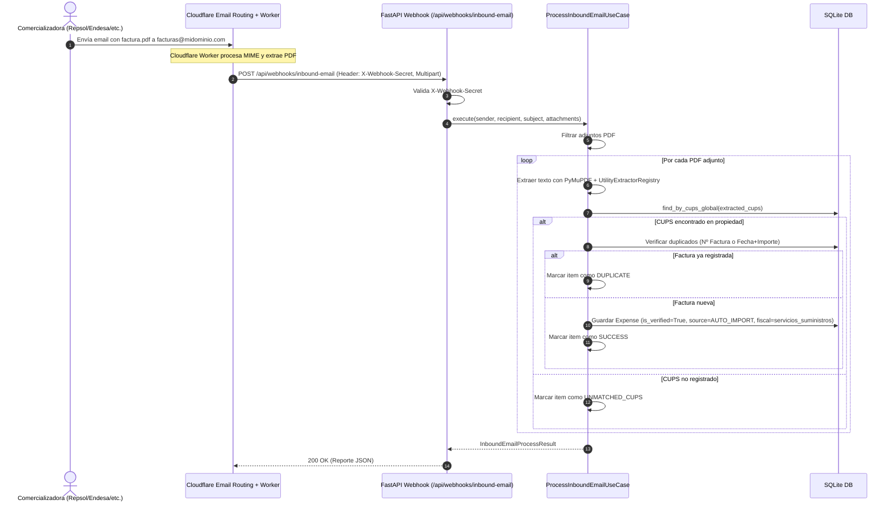

# 📐 Especificación Técnica — F-21: Ingesta Automática de Facturas por Email vía Inbound Webhook con Búsqueda Global de CUPS

> **Feature:** F-21  
> **Título:** Ingesta Automática por Email: Inbound Parse Webhook con Búsqueda Global de CUPS (Zero-Cost & Event-Driven)  
> **Épica:** E-02 — Automatización de Gastos de Suministros vía Email  
> **Estado:** Paso 1 — Especificación Técnica  
> **Fecha:** 2026-09-05  
> **Dependencias:** F-16 (Modelo de Dominio: CUPS) ✅, F-17 (Puerto LLM) ✅, F-18 (Motor de Extracción PyMuPDF + Strategy) ✅, F-20 (Deduplicación y Contabilización Directa) ✅  
> **Normativa de diseño:** Directrices de alta artesanía de [`.agent/skills/anti-slop-ui/SKILL.md`](file:///home/carlos/rental-handler/.agent/skills/anti-slop-ui/SKILL.md)  

---

## 1. Contexto y Objetivo

Tras la implementación de la subida directa de facturas y deduplicación en **F-20**, la feature **F-21** completa el objetivo fundacional de la épica **E-02**: **automatizar al 100% la entrada de facturas sin intervención manual del usuario ni consumo de recursos ociosos en el servidor**.

### ¿Qué problema resuelve?

1. **Eliminación de tareas repetitivas:** Cada mes, las comercializadoras de suministros (Repsol, Endesa, Iberdrola, Naturgy, etc.) emiten facturas en PDF por correo electrónico. El propietario no debería tener que descargar el PDF a su ordenador y subirlo a la plataforma.
2. **Máxima Privacidad y Cero Auditorías (No IMAP):** No se accede a la bandeja personal del usuario ni se solicitan contraseñas de correo o permisos OAuth restrictivos (`mail.read`), lo que evita auditorías de seguridad costosas (CASA/Google Cloud) y facilita la aprobación en tiendas de aplicaciones.
3. **Eficiencia de Recursos y Coste Cero (Push vs. Pull):** Se descarta el *polling* periódico por IMAP (que consume memoria y ciclos de CPU en el VPS comprobando bandejas vacías). En su lugar, se adopta un **Webhook HTTP Event-Driven**: el sistema solo consume recursos cuando entra un correo.
4. **Búsqueda Global de CUPS (Fricción Cero para el Usuario):** En España, el código CUPS (*Código Unificado de Punto de Suministro*) es unívoco a nivel nacional para cada contador físico. Por tanto, basta con enviar el correo a una dirección común (ej. `facturas@midominio.com` o filtro de reenvío automático) y el backend resuelve automáticamente la propiedad y el usuario propietario mediante el CUPS extraído.
5. **Compatibilidad con Proveedores de Email Gratuitos:** Se diseña con soporte para la capa gratuita permanente de **Cloudflare Email Routing + Cloudflare Worker** (100% gratuito sin tarjeta de crédito), SendGrid Inbound Parse o Mailgun.

### ¿Qué NO entra en esta feature?
- Gestión y lectura de correos sin adjuntos o no relacionados con suministros.
- Interfaz de configuración de servidores IMAP en los ajustes de usuario (descartado en favor de Webhook).
- Almacenamiento físico definitivo de PDFs en buckets cloud (F-19, diferida). El PDF se procesa en memoria.

---

## 2. Lenguaje Ubicuo (Términos de la Feature)

| Término | Definición |
|---|---|
| **Inbound Parse Webhook** | Endpoint HTTP que recibe las peticiones POST enviadas por un servicio de correo entrante (ej. Cloudflare Worker o SendGrid) conteniendo los metadatos y adjuntos del email. |
| **Global CUPS Lookup** | Consulta a base de datos para localizar la propiedad asociada a un CUPS en todo el catálogo del sistema, sin requerir `user_id` previo, aprovechando la unicidad del código en España. |
| **X-Webhook-Secret** | Token secreto de autenticación transmitido en la cabecera HTTP para verificar que la petición procede exclusivamente de nuestro worker/servicio de correo autorizado. |
| **InboundEmailMessage** | DTO que encapsula los datos del correo recibido: remitente, destinatario, asunto y lista de adjuntos binarios. |
| **Cloudflare Email Worker** | Script serverless ligero desplegado en la capa gratuita de Cloudflare que recibe el stream del correo de Cloudflare Email Routing y lo remite mediante POST a nuestra API. |

---

## 3. Experiencia de Usuario (UX) y Flujo de Interacción

### 3.1 Flujo de Ingesta Automática End-to-End



### 3.2 Experiencia en el Dashboard Web
- El usuario no necesita hacer nada mensual: la factura aparece automáticamente en su tabla de gastos con el badge neutral del proveedor (`Repsol`, `Endesa`, etc.) y sus balances contables actualizados.
- En el modal de subida (`InvoiceUploadModal.tsx`), se incluye una tarjeta informativa sutil:
  > *"¿Sabías que puedes automatizar esto? Configura el envío de facturas a **`facturas@arrendis.com`** o crea una regla de reenvío en tu correo. El sistema las asignará automáticamente a tu propiedad mediante el CUPS."*

---

## 4. Diseño de la Arquitectura Hexagonal

```
backend/
├── domain/
│   ├── ports.py                    # PropertyRepository.find_by_cups_global(cups)
│   └── value_objects.py            # InboundEmailMessage, InboundAttachment
├── application/
│   └── use_cases.py                # ProcessInboundEmailUseCase
├── adapters/
│   └── sqlite_adapter.py           # SQLitePropertyRepository.find_by_cups_global
└── api/
    ├── routes/
    │   └── webhooks.py             # Router POST /api/webhooks/inbound-email
    └── schemas.py                  # InboundEmailWebhookResponse, InboundEmailItemResult
```

### 4.1 Puerto de Dominio: `PropertyRepository.find_by_cups_global`

En [`backend/domain/ports.py`](file:///home/carlos/rental-handler/backend/domain/ports.py):

```python
@abstractmethod
def find_by_cups_global(self, cups: str) -> Property | None:
    """Busca una propiedad en todo el sistema que tenga asignado el código CUPS indicado.
    
    A diferencia de find_by_cups(cups, user_id), este método no requiere user_id,
    permitiendo el enrutamiento de facturas entrantes donde el usuario se infiere del CUPS.
    """
    ...
```

### 4.2 Caso de Uso: `ProcessInboundEmailUseCase` y Capa Anti-Spoofing de Remitente

En [`backend/application/use_cases.py`](file:///home/carlos/rental-handler/backend/application/use_cases.py):

```python
class ProcessInboundEmailUseCase:
    """Caso de uso para procesar correos entrantes reenviados por usuarios con facturas adjuntas."""

    def __init__(
        self,
        property_repo: PropertyRepository,
        expense_repo: ExpenseRepository,
        user_repo: UserRepository,
        extractor_registry: UtilityExtractorRegistry,
        fallback_strategy: ExtractionStrategy | None = None,
    ) -> None:
        self._property_repo = property_repo
        self._expense_repo = expense_repo
        self._user_repo = user_repo
        self._extractor_registry = extractor_registry
        self._fallback_strategy = fallback_strategy

    def execute(
        self,
        sender: str,
        recipient: str,
        subject: str,
        attachments: list[tuple[str, bytes]],  # (filename, content)
    ) -> InboundEmailProcessResult:
        ...
```

#### 🛡️ Modelo de Seguridad: Reenvío Autorizado por Remitente y Mapeo de Correo Origen

Por diseño de producto y privacidad, **nunca se le pide al usuario que cambie su correo personal en la compañía eléctrica** por el de la app. El usuario siempre recibe las facturas en su propio buzón de correo y las reenvía (manualmente o mediante una regla de filtro automático en Gmail/Outlook) a `facturas@arrendis.com`.

Para evitar cualquier tipo de inyección ilegítima o spoofing de CUPS por parte de terceros:

1. **Mapeo de Correo de Origen Autorizado (`find_by_sender_email`):**
   - El sistema analiza la cabecera `From` del correo y extrae la dirección de email limpia (ej. de `Carlos Cano <carlos@gmail.com>` a `carlos@gmail.com`).
   - Busca en la base de datos si el remitente coincide con:
     - El email de registro/login del usuario (`user.email`), **O BIEN**
     - El email de facturas alternativo configurado por el usuario (`user.forwarding_email`), por si sus facturas le llegan a una cuenta de correo distinta a la que usó para registrarse.
   - Si no existe ningún usuario autorizado con ese remitente -> **Rechazo inmediato** (`status: "unauthorized_sender"`, sin crear gastos).
2. **Validación de Propiedad por CUPS (`find_by_cups(cups, user_id=user.id)`):**
   - Si el remitente es un usuario legítimo, se extrae el CUPS del PDF.
   - La búsqueda del inmueble se realiza **exclusivamente dentro de las propiedades del usuario remitente** (`user_id=user.id`).
   - Si el PDF contiene un CUPS de otra persona o un CUPS manipulado que no le pertenece -> **Rechazo inmediato** (`status: "cups_not_owned"`).
3. **Filtro de archivos y Privacidad:**
   - Descarta archivos que no sean PDF (`.pdf`). Si no hay PDFs, retorna `status="ignored"`.
   - Se ejecuta el pipeline de extracción (PyMuPDF + Regex/IA con privacidad).
4. **Idempotencia y Anti-Duplicados:**
   - Comprueba si en los gastos de esa propiedad ya existe una factura con el mismo número o misma fecha e importe. Si existe, estado `DUPLICATE` y omite inserción.
5. **Contabilización Directa:**
   - Si es válida y nueva: inserta el gasto con `is_verified = True`, `source = ExpenseSource.AUTO_IMPORT`, y `fiscal_category = FiscalExpenseCategory.SERVICIOS_SUMINISTROS`.

#### ⚖️ Consentimiento Explícito (GDPR / Buenas Prácticas)
En la interfaz del usuario donde se muestra la dirección `facturas@arrendis.com` y se permite configurar el email de origen alternativo, se incluye obligatoriamente el texto legal:
> *"Al reenviar correos a esta dirección, autorizas el procesamiento automatizado del documento para extraer los datos de la factura."*


### 4.3 Endpoint de Webhook REST: `POST /api/webhooks/inbound-email`

- **Content-Type:** `multipart/form-data`
- **Cabecera de autenticación:** `X-Webhook-Secret: <token_secreto>`
  - El token se configura mediante la variable de entorno `INBOUND_WEBHOOK_SECRET` (con valor por defecto seguro para desarrollo).
  - Si falta o no coincide: `401 Unauthorized`.
- **Campos esperados en el formulario multipart:**
  - `from` o `sender`: remitente del correo
  - `to` o `recipient`: destinatario
  - `subject`: asunto
  - `files` o `attachments`: lista de archivos adjuntos (`UploadFile`)
- **Respuesta (200 OK):**
  ```json
  {
    "status": "success",
    "sender": "facturacion@repsol.com",
    "subject": "Tu factura de luz Repsol",
    "total_attachments": 1,
    "processed_count": 1,
    "duplicate_count": 0,
    "unmatched_count": 0,
    "error_count": 0,
    "items": [
      {
        "filename": "factura_julio.pdf",
        "status": "success",
        "property_id": "796adc13-d7e5-414e-bd8d-6944b47ecbd9",
        "property_name": "Piso Gran Vía",
        "cups": "ES0031103721971011PR0F",
        "amount": 75.46,
        "provider_name": "Repsol Comercializadora de Electricidad y Gas, S.L.U.",
        "invoice_number": "61088387754",
        "message": "Factura importada y contabilizada correctamente."
      }
    ]
  }
  ```

---

## 5. Blueprint de Infraestructura: Cloudflare Email Routing + Worker (100% Free)

Se incluye el script `scripts/cloudflare_email_worker.js` para su despliegue inmediato en Cloudflare Workers:

```javascript
/**
 * Cloudflare Email Worker para Rental Handler
 * Recibe correos en facturas@tudominio.com y los reenvía vía Webhook POST a la API.
 */
import PostalMime from 'postal-mime';

export default {
  async email(message, env, ctx) {
    const rawEmail = await new Response(message.raw).arrayBuffer();
    const parser = new PostalMime();
    const parsedEmail = await parser.parse(rawEmail);

    const formData = new FormData();
    formData.append('from', message.from);
    formData.append('to', message.to);
    formData.append('subject', parsedEmail.subject || '');

    for (const att of parsedEmail.attachments) {
      if (att.mimeType === 'application/pdf' || att.filename?.toLowerCase().endsWith('.pdf')) {
        const blob = new Blob([att.content], { type: 'application/pdf' });
        formData.append('files', blob, att.filename || 'factura.pdf');
      }
    }

    const webhookUrl = env.RENTAL_HANDLER_WEBHOOK_URL || 'https://tu-api.com/api/webhooks/inbound-email';
    const webhookSecret = env.RENTAL_HANDLER_WEBHOOK_SECRET;

    const response = await fetch(webhookUrl, {
      method: 'POST',
      headers: {
        'X-Webhook-Secret': webhookSecret,
      },
      body: formData,
    });

    if (!response.ok) {
      console.error(`Error forwarding email to webhook: ${response.status} ${await response.text()}`);
    }
  }
};
```

---

## 6. Especificación de Tests

### 6.1 Tests de Persistencia (SQLite y Memoria)
- **T-F21-DB-01:** `find_by_cups_global` encuentra la propiedad por `cups_electricity`, `cups_gas` o `cups_water`.
- **T-F21-DB-02:** `find_by_cups_global` devuelve `None` cuando el CUPS no existe en ninguna propiedad.

### 6.2 Tests Unitarios del Caso de Uso (`ProcessInboundEmailUseCase`)
- **T-F21-UC-01:** Correo con remitente coincidente con el propietario y PDF de Repsol válido asigna el gasto con `is_verified=True`.
- **T-F21-UC-02:** Correo sin adjuntos o con adjuntos no-PDF devuelve estado `ignored`.
- **T-F21-UC-03:** Correo con factura cuyo CUPS no existe en la base de datos devuelve item con status `unmatched_cups`.
- **T-F21-UC-04:** Correo con factura ya existente devuelve item con status `duplicate`.
- **T-F21-UC-05:** Correo con múltiples PDFs procesa cada uno de forma independiente sin abortar el lote.
- **T-F21-UC-06 (Anti-Spoofing):** Correo a `facturas@midominio.com` desde un remitente que no es el propietario del CUPS devuelve item con status `unauthorized_sender` y no crea ningún gasto.
- **T-F21-UC-07 (Anti-Spoofing):** Correo a dirección privada `prop-{id}@midominio.com` con un PDF cuyo CUPS no coincide con el de esa propiedad devuelve status `cups_mismatch` y no crea ningún gasto.

### 6.3 Tests de API / Webhook (`POST /api/webhooks/inbound-email`)
- **T-F21-API-01:** Petición sin cabecera `X-Webhook-Secret` o con secret incorrecto devuelve `401 Unauthorized`.
- **T-F21-API-02:** Petición válida con secret y PDF procesa el gasto y devuelve `200 OK` con el desglose.
- **T-F21-API-03:** Petición con factura duplicada devuelve `200 OK` informando del duplicado.
- **T-F21-API-04:** Petición con remitente no autorizado devuelve `200 OK` informando de `unauthorized_sender` sin modificar la contabilidad.

---

## 7. Plan de Archivos

### Archivos a Crear
- `specs/epics/E-02-suministros/F-21/design.md` (este documento)
- `backend/api/routes/webhooks.py` (router de webhooks)
- `scripts/cloudflare_email_worker.js` (script turnkey para Cloudflare Worker)
- `tests/unit/backend/api/test_f21_inbound_email_api.py` (suite de tests unitarios y de integración para F-21)

### Archivos a Modificar
- `backend/domain/ports.py`: Añadir `find_by_cups_global(cups: str) -> Property | None` a `PropertyRepository`.
- `backend/adapters/sqlite_adapter.py`: Implementar `find_by_cups_global` en `SQLitePropertyRepository`.
- `tests/unit/conftest.py`: Implementar `find_by_cups_global` en `InMemoryPropertyRepository`.
- `backend/application/use_cases.py`: Implementar `ProcessInboundEmailUseCase`.
- `backend/api/schemas.py`: Añadir schemas para la respuesta del webhook.
- `backend/main.py`: Registrar el router `webhooks.router`.
- `frontend/src/components/InvoiceUploadModal.tsx`: Añadir nota informativa sobre el buzón automático.
- `feature_list.json`: Actualizar el título y estado de F-21.

---

## 8. 📚 El Rincón del Estudiante

### 💡 ¿Por qué la arquitectura Push (Webhooks) es superior a Pull (IMAP Polling) en proyectos lean?

1. **Eficiencia en reposo:** Con IMAP polling, un worker debe conectarse cada 5 minutos a revisar bandejas de entrada que el 99% de las veces están vacías. Esto desgasta recursos, satura logs y mantiene hilos ocupados. Con un Webhook, el consumo en reposo es **cero absoluto**.
2. **Cero almacenamiento de secretos sensibles:** Con IMAP tendrías que guardar contraseñas de correo o tokens de acceso en tu base de datos (con el riesgo de brecha de seguridad que ello conlleva). Con Webhook, el usuario no te da ninguna contraseña: solo le pide a su compañía que envíe la factura a una dirección de reenvío.
3. **Unicidad del CUPS como clave de enrutamiento:** El CUPS consta de 20 o 22 caracteres alfanuméricos (`ES` + 16 dígitos + 2 letras de control). El marco legal español garantiza que no existen dos puntos de suministro con el mismo código. Esto convierte al CUPS en el enrutador natural definitivo para una aplicación de alquileres.
