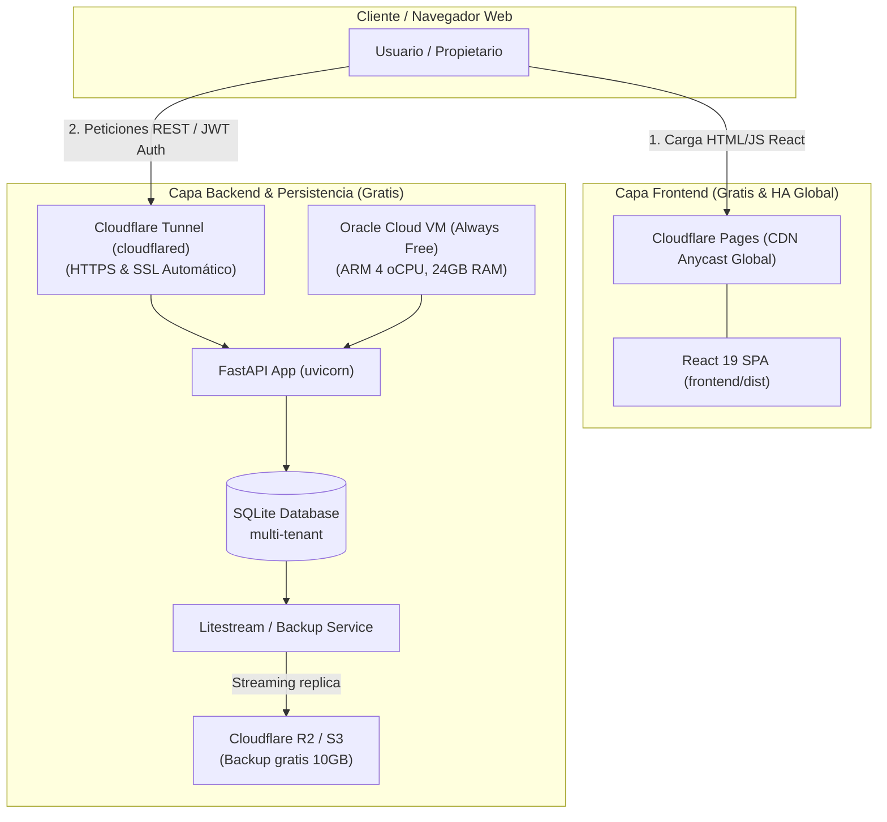

# Estrategia de Despliegue Gratuito y de Alta Disponibilidad (HA) — Rental Handler

Este documento recopila el análisis técnico y la hoja de ruta para desplegar **Rental Handler** en producción de forma **100% gratuita (0 €/mes)** y con **alta disponibilidad (99,99%+)**, basándose en lecciones aprendidas de arquitecturas Jamstack desacopladas (como el patrón de `matelekinhos-fantasy`).

---

## 1. Contexto y Análisis Comparativo

### Lección de `matelekinhos-fantasy`:
Ese proyecto logra coste 0€ y disponibilidad indestructible separando totalmente el procesamiento de datos del hosting web:
- **Ingest/ETL**: Una VM de Oracle Cloud (Always Free) ejecuta un cron que procesa datos de APIs externas y genera un paquete JS de métricas.
- **Frontend & CDN**: Los archivos web estáticos se sirven en **Cloudflare Pages**, respaldados por **Cloudflare Access (Zero Trust)** para autenticación SSO/OTP gratuita.

### Aplicabilidad a `Rental Handler`:
| Dimensión | `matelekinhos-fantasy` | `Rental Handler` |
| :--- | :--- | :--- |
| **Tecnología Frontend** | Vanilla JS + HTML estático | React 19 + TypeScript + Vite |
| **Tecnología Backend** | Python Scripts (Cron / Ingestion) | Python (FastAPI) + Arquitectura Hexagonal |
| **Base de Datos** | SQLite append-only (snapshot global) | SQLite multi-tenant (aislamiento por usuario) |
| **Operativa** | Read-Heavy Batch (Lectura masiva global) | Write/Read Interactive (CRUD transaccional en tiempo real) |
| **Aproximación Despliegue** | Batch Pre-rendering estático | **Híbrido Frontend Estático CDN + Backend Serverless/VM** |

> ⚠️ **Nota clave**: Debido a la naturaleza interactiva, multi-tenant y de cálculo fiscal en tiempo real de Rental Handler, **no es posible usar un pre-rendering batch estático idéntico**. Sin embargo, **SÍ se puede lograr un despliegue 0 €/mes y de Alta Disponibilidad** adaptando la arquitectura en dos capas independientes.

---

## 2. Arquitectura Propuesta para Rental Handler (0 €/mes)



---

## 3. Opciones de Implementación

### Opción 1 (Recomendada): Cloudflare Pages + Oracle Cloud Always Free + Cloudflare Tunnel

Esta opción reutiliza los recursos gratuitos más potentes del mercado:

1. **Frontend (React 19 + Vite)**:
   - **Hosting**: Cloudflare Pages.
   - **Proceso**: Ejecutar `npm run build` en `frontend/` y publicar la carpeta `dist/`.
   - **Beneficios**: Alta disponibilidad nativa (CDN global), tiempo de respuesta < 20ms, ancho de banda ilimitado, HTTPS automático.
   - **Comando**: `npx wrangler pages deploy frontend/dist --project-name rental-handler`

2. **Backend (FastAPI + Arquitectura Hexagonal)**:
   - **Hosting**: Instancia VM ARM Ampere en **Oracle Cloud Infrastructure (OCI) Always Free** (4 oCPUs, 24 GB RAM, 200 GB disco gratis de por vida).
   - **Exposición Segura**: Usar **Cloudflare Tunnel** (`cloudflared`) instalado en la VM. Permite conectar el backend a un subdominio (p. ej. `api-rental.tudominio.com`) sin abrir puertos en el router/firewall ni requerir IP pública fija.

3. **Base de Datos y Persistencia (SQLite + Litestream)**:
   - **Desafío**: Al usar SQLite en una VM, es crucial garantizar copias de seguridad continuas para evitar pérdida de datos si la VM falla.
   - **Solución**: Instalar **Litestream** en la VM. Litestream realiza un streaming de replicación paso a paso del archivo SQLite hacia **Cloudflare R2** (10 GB gratis al mes) o **AWS S3 Free Tier**.

---

### Opción 2 (Serverless PaaS): Cloudflare Pages + Render / Koyeb + Turso DB

Para una alternativa donde **no se gestione ninguna máquina virtual Linux**:

1. **Frontend**: Cloudflare Pages / Vercel (Gratis).
2. **Backend**: Desplegar el contenedor Docker de FastAPI en **Render Free Tier**, **Koyeb Free Tier** o **Fly.io**.
3. **Base de Datos Edge (Turso)**:
   - Reemplazar SQLite en archivo local por **Turso** (SQLite distribuido Serverless basado en libSQL).
   - **Plan Gratuito de Turso**: 9 GB de almacenamiento total, 500 bases de datos, 1.000.000 escrituras/mes gratis.

---

## 4. Guía Paso a Paso para la Puesta en Producción (Futuro)

### Paso 1: Preparar el Frontend para Producción
1. Configurar la variable de entorno de API en el frontend (`.env.production`):
   ```env
   VITE_API_URL=https://api-rental.tu-dominio.com
   ```
2. Compilar el proyecto React:
   ```bash
   cd frontend
   npm run build
   ```
3. Crear proyecto en Cloudflare Pages y desplegar `frontend/dist`.

### Paso 2: Crear e Inicializar la VM en Oracle Cloud
1. Registrarse en Oracle Cloud (Cuenta Always Free).
2. Crear instancia Ampere ARM (Ubuntu 22.04 / 24.04 LTS, 4 oCPUs, 24 GB RAM).
3. Instalar Python 3.12, `venv` y clonar el repositorio de Rental Handler.

### Paso 3: Exponer FastAPI con Cloudflare Tunnel
1. Instalar `cloudflared` en la VM de Oracle:
   ```bash
   curl -L --output cloudflared.deb https://github.com/cloudflare/cloudflared/releases/latest/download/cloudflared-linux-arm64.deb
   sudo dpkg -i cloudflared.deb
   ```
2. Autenticar y crear túnel apuntando a `http://localhost:8000`.

### Paso 4: Configurar Servicio Systemd para FastAPI
Crear `/etc/systemd/system/rental-backend.service`:
```ini
[Unit]
Description=Rental Handler FastAPI Backend
After=network.target

[Service]
User=ubuntu
WorkingDirectory=/home/ubuntu/rental-handler
ExecStart=/home/ubuntu/rental-handler/venv/bin/uvicorn backend.api.main:app --host 127.0.0.1 --port 8000 --workers 4
Restart=always

[Install]
WantedBy=multi-user.target
```

### Paso 5: Replicación de SQLite con Litestream
1. Instalar Litestream:
   ```bash
   wget https://github.com/benbjohnson/litestream/releases/download/v0.3.13/litestream-v0.3.13-linux-arm64.tar.gz
   tar -xzf litestream-v0.3.13-linux-arm64.tar.gz
   sudo mv litestream /usr/local/bin/
   ```
2. Configurar `/etc/litestream.yml` para replicar `rental.db` a Cloudflare R2 / S3.

---

## 5. Referencias y Documentación Oficial

- 📖 **Cloudflare Pages**: [https://developers.cloudflare.com/pages/](https://developers.cloudflare.com/pages/)
- 📖 **Cloudflare Tunnels**: [https://developers.cloudflare.com/cloudflare-one/connections/connect-networks/](https://developers.cloudflare.com/cloudflare-one/connections/connect-networks/)
- 📖 **Oracle Cloud Always Free**: [https://www.oracle.com/cloud/free/](https://www.oracle.com/cloud/free/)
- 📖 **Litestream (SQLite Streaming Replication)**: [https://litestream.io/](https://litestream.io/)
- 📖 **Turso Serverless SQLite**: [https://turso.tech/](https://turso.tech/)
